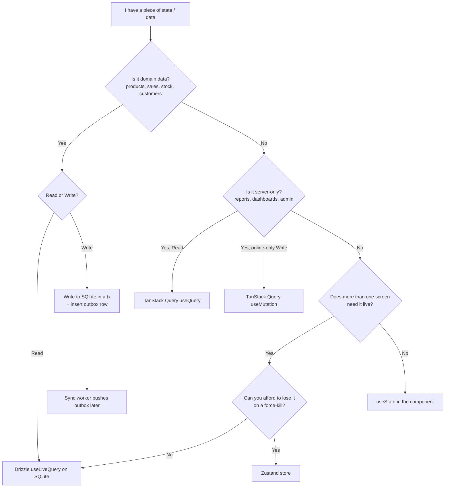
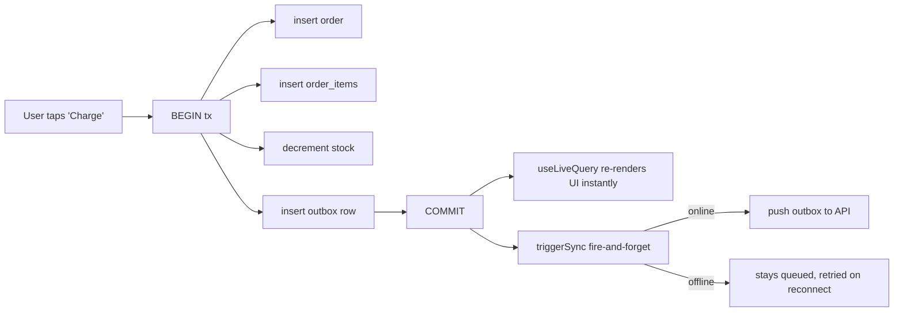
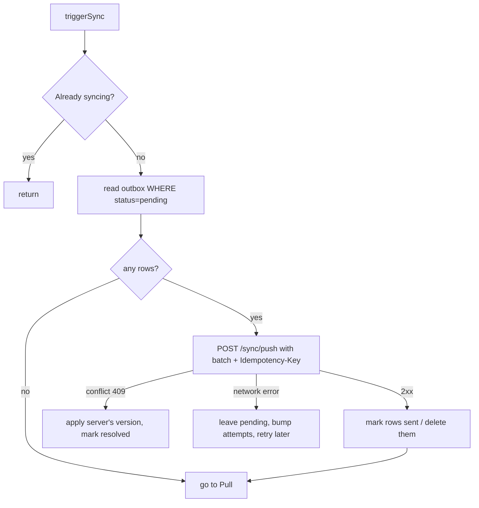
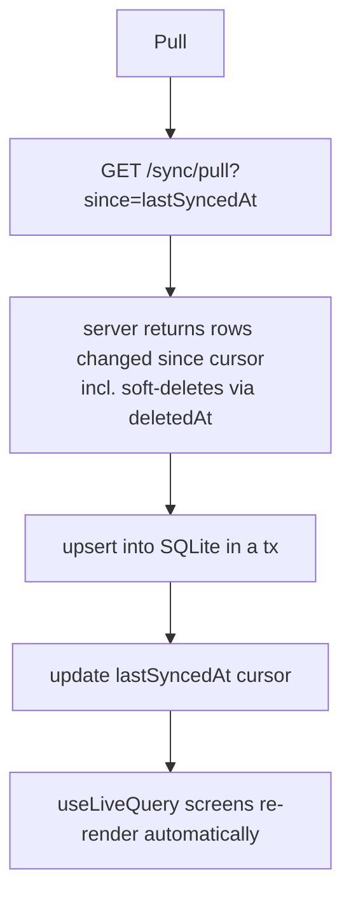

# API Calls & State Management — Offline-First POS Guide

> Stack: **Expo Router · expo-sqlite + Drizzle · TanStack Query · Zustand · expo-secure-store**
> Backend: **NestJS · Drizzle · PostgreSQL** (sync via `/sync/pull` + `/sync/push`)
> Scope: how data is read, written, cached, and synced — and exactly which tool owns each flow.

---

## Table of Contents

1. [The One Rule That Governs Everything](#1-the-one-rule-that-governs-everything)
2. [The Four Data Buckets](#2-the-four-data-buckets)
3. [Master Decision Flow](#3-master-decision-flow)
4. [What TanStack Query Is — and Is *Not* — Here](#4-what-tanstack-query-is--and-is-not--here)
5. [TanStack Query Setup for Offline-First Expo](#5-tanstack-query-setup-for-offline-first-expo)
6. [Queries — When and How](#6-queries--when-and-how)
7. [Mutations — When and How](#7-mutations--when-and-how)
8. [The Offline Write Path (SQLite + Outbox)](#8-the-offline-write-path-sqlite--outbox)
9. [The Sync Flow in Detail](#9-the-sync-flow-in-detail)
10. [Local Component State (`useState`)](#10-local-component-state-usestate)
11. [Global Client State (Zustand)](#11-global-client-state-zustand)
12. [Auth State & Tokens](#12-auth-state--tokens)
13. [Cache Invalidation Strategy](#13-cache-invalidation-strategy)
14. [Error Handling & Retries](#14-error-handling--retries)
15. [Loading, Empty & Error UI States](#15-loading-empty--error-ui-states)
16. [Query Key Conventions](#16-query-key-conventions)
17. [Anti-Patterns](#17-anti-patterns)
18. [Quick Reference Cheat-Sheet](#18-quick-reference-cheat-sheet)

---

## 1. The One Rule That Governs Everything

**Your source of truth is the on-device SQLite database, not the network and not the TanStack Query cache.**

Everything else follows from this. In a normal online app, the server is the source of truth and TanStack Query mirrors it. In *your* offline-first POS, the **local SQLite DB is authoritative**; the server is a replica that SQLite syncs *to* and *from* in the background.

That inverts the usual advice:

| Normal online app | Your offline-first POS |
|---|---|
| Read domain data → `useQuery` | Read domain data → **Drizzle `useLiveQuery` on SQLite** |
| Write domain data → `useMutation` | Write domain data → **SQLite write + outbox row** |
| TanStack Query = the data layer | TanStack Query = the **online edge only** |

If you remember nothing else: **domain reads and writes never touch the network directly. They touch SQLite. The sync worker is the only thing that talks to your API for domain data.**

---

## 2. The Four Data Buckets

Every piece of state in the app falls into exactly one bucket. Identify the bucket → the tool is decided.

### Bucket A — Persistent domain data → **SQLite (Drizzle)**
Products, orders/sales, order items, customers, stock levels, shifts, the outbox.
- **Read:** `useLiveQuery(db.select()...)` — reactive, re-renders on table change.
- **Write:** `db.insert/update` inside a transaction, **plus an outbox row**.
- **Never** stored in TanStack Query or Zustand. Those would be stale duplicates.

### Bucket B — Server-only data → **TanStack Query**
Data you only ever read while online and never persist locally: analytics dashboards, cross-store reports, admin lists, anything too large or too live to keep on device.
- **Read:** `useQuery`.
- **Write:** rare; `useMutation` only for genuinely online-only actions.

### Bucket C — Global ephemeral UI/session state → **Zustand (one small store)**
`isAuthenticated`, current user, role/permissions, selected store, active shift, sync-status flag.
- Survives navigation, lost on force-kill (which is fine — it's re-hydrated on launch).
- Anything here that you *can't* lose belongs in Bucket A instead.

### Bucket D — Local component state → **`useState`**
Modal open/closed, form inputs, search text, a toggle, the current tab within a screen.
- Never leaves the component. No store, no query.

> **Tokens are a special case** (Bucket E): access/refresh tokens live in **expo-secure-store**, never in memory, never in SQLite. See §12.

---

## 3. Master Decision Flow



The single most important branch is the first one. **Domain data → SQLite.** Get that right and the rest is easy.

---

## 4. What TanStack Query Is — and Is *Not* — Here

**TanStack Query is your online-edge toolkit.** It manages *server state* — the async, cacheable, can-be-stale data that lives behind your API. It excels at: caching, deduping, background refetch, retry, loading/error states, and **pausing mutations while offline and resuming on reconnect**.

In this app it has **three legitimate jobs**:

1. **Server-only reads** (Bucket B) — reports, dashboards, admin screens.
2. **Online-only actions** — login, password reset, "email this receipt now," fetching a one-off remote resource.
3. **Optionally, the transport inside the sync worker** — though a plain `fetch` is just as valid there.

It is **NOT**:
- ❌ Your domain data store — that's SQLite.
- ❌ The thing that writes a sale — that's a SQLite write + outbox.
- ❌ A replacement for the sync worker — the worker owns domain push/pull.

> **Why not just use TanStack Query for everything, even offline writes?**
> Its persisted-mutation queue *can* pause and resume mutations offline. But for a POS that's not enough: a sale must be **queryable, reportable, and editable while still offline and unsynced** (e.g. void a sale you made 10 minutes ago with no signal). A paused mutation is an opaque blob waiting to fire — it's not a row you can read, list, or modify. Only a real local DB gives you that. So domain writes go to SQLite; TanStack Query's offline-mutation feature is reserved for Bucket B's rare online-only writes.

---

## 5. TanStack Query Setup for Offline-First Expo

Three things must be wired for TanStack Query to behave on mobile: **online detection**, **persistence**, and **network mode**.

```typescript
// app/_providers/query.tsx
import { QueryClient, onlineManager, focusManager } from '@tanstack/react-query';
import { PersistQueryClientProvider } from '@tanstack/react-query-persist-client';
import { createAsyncStoragePersister } from '@tanstack/query-async-storage-persister';
import AsyncStorage from '@react-native-async-storage/async-storage';
import * as Network from 'expo-network';
import { AppState, type AppStateStatus } from 'react-native';
import { useEffect } from 'react';

// 1. Online detection — feed Expo network status into TanStack Query
onlineManager.setEventListener((setOnline) => {
  const sub = Network.addNetworkStateListener((state) => setOnline(!!state.isConnected));
  return () => sub.remove();
});

export const queryClient = new QueryClient({
  defaultOptions: {
    queries: {
      // 3. networkMode: try cache/queue even when offline instead of erroring
      networkMode: 'offlineFirst',
      staleTime: 30_000,          // sane default; override per query
      gcTime: 1000 * 60 * 60 * 24, // keep cache 24h so persisted data survives restarts
      retry: 2,
    },
    mutations: {
      networkMode: 'offlineFirst',
      retry: 0,
    },
  },
});

// 2. Persistence — survive app restarts (mainly for Bucket B reads)
const persister = createAsyncStoragePersister({
  storage: AsyncStorage,
  throttleTime: 3000,
});

export function QueryProvider({ children }: { children: React.ReactNode }) {
  // Refetch when the app returns to the foreground
  useEffect(() => {
    const sub = AppState.addEventListener('change', (status: AppStateStatus) =>
      focusManager.setFocused(status === 'active'),
    );
    return () => sub.remove();
  }, []);

  return (
    <PersistQueryClientProvider
      client={queryClient}
      persistOptions={{ persister, maxAge: 1000 * 60 * 60 * 24 }}
      onSuccess={() => queryClient.resumePausedMutations()}
    >
      {children}
    </PersistQueryClientProvider>
  );
}
```

**`networkMode` cheat-sheet:**
- `'online'` (default) — pauses queries when offline. Wrong for this app.
- `'offlineFirst'` — runs once (hits persisted cache), pauses retries while offline, resumes on reconnect. **Use this.**
- `'always'` — ignores online status entirely. Use only for things that read purely local data.

---

## 6. Queries — When and How

### A query is a **read** of async data you don't mutate directly.

Use `useQuery` (TanStack) **only for Bucket B** — server-only data. For domain data use Drizzle's `useLiveQuery` instead (covered below).

### When to use `useQuery` (TanStack)
- Sales report for the month (computed server-side).
- Admin dashboard totals across stores.
- A remote resource you don't cache locally (e.g. tax-rate lookup).
- Any read where the **server is the source of truth** and you're online.

### When to use `useLiveQuery` (Drizzle/SQLite) instead
- The product catalog shown at checkout.
- The list of today's orders.
- Current stock for a product.
- **Anything in Bucket A.** It reads SQLite and re-renders automatically when the table changes — no manual invalidation, no network.

```typescript
// Bucket A — domain read from SQLite (NOT useQuery)
import { useLiveQuery } from 'drizzle-orm/expo-sqlite';
import { eq, isNull } from 'drizzle-orm';
import { db } from '@/db/client';
import { products } from '@/db/schema';

function Catalog() {
  const { data, error } = useLiveQuery(
    db.select().from(products).where(isNull(products.deletedAt)),
  );
  // `data` updates live whenever the products table changes — including after a sync pull.
  return <ProductGrid items={data ?? []} />;
}
```

```typescript
// Bucket B — server-only read with TanStack Query
import { useQuery } from '@tanstack/react-query';
import { api } from '@/lib/api';

function MonthlyReport({ month }: { month: string }) {
  const { data, isLoading, isError, refetch } = useQuery({
    queryKey: ['reports', 'monthly', month],
    queryFn: () => api.get(`/reports/monthly?month=${month}`),
    staleTime: 1000 * 60 * 5, // reports don't change every second
  });
  // render loading / error / data
}
```

### Query best practices
- **Structured, hierarchical query keys** — `['reports', 'monthly', month]`, not `['monthlyReport' + month]`. Enables targeted invalidation (§16).
- **Set `staleTime` deliberately.** `0` refetches aggressively; for reports, minutes. The default above is 30s.
- **Keep `queryFn` pure** — just fetch and return; no side effects, no writing to SQLite from inside a query.
- **Derive, don't duplicate.** Don't copy query data into `useState`; read it where you need it.
- **`enabled` for dependent queries** — `enabled: !!storeId` so it doesn't fire before you have the input.
- **`select` to transform/narrow** — keeps components re-rendering only on the slice they use.

---

## 7. Mutations — When and How

### A mutation is a **write** (create/update/delete) of async server data.

Here's the critical split for your app — there are **two kinds of write**, and only one of them is a TanStack `useMutation`.

### Write Type 1 — Domain write → **SQLite + outbox** (NOT `useMutation`)
Creating a sale, voiding an order, adjusting stock, editing a product. These must work offline, stay queryable, and sync later. They are **not** TanStack mutations. See §8 for the full pattern. In short:

```typescript
// Bucket A write — a sale. This is the 99% case for a POS.
async function createSale(cart: CartItem[], userId: string) {
  await db.transaction(async (tx) => {
    const id = randomUUID();                          // client-generated UUID
    await tx.insert(orders).values({ id, status: 'paid', /* ... */ });
    await tx.insert(orderItems).values(cart.map(/* ... */));
    await decrementStock(tx, cart);
    await tx.insert(outbox).values({                  // queue for sync
      id: randomUUID(),
      entity: 'order',
      entityId: id,
      op: 'create',
      payload: JSON.stringify({ /* full order */ }),
      createdAt: new Date().toISOString(),
    });
  });
  // No network here. The UI already re-renders via useLiveQuery.
  triggerSync();                                       // fire-and-forget; safe if offline
}
```

### Write Type 2 — Online-only action → **`useMutation`** (Bucket B)
Genuinely server-side, not part of the offline domain model: login, request password reset, "email this receipt now," kick off a server-side export. These can use TanStack Query because it's acceptable for them to *require* connectivity (or to pause-and-resume via the persisted queue).

```typescript
// Bucket B mutation — login (online-only)
import { useMutation } from '@tanstack/react-query';

function useLogin() {
  return useMutation({
    mutationFn: (creds: Credentials) => api.post('/auth/login', creds),
    onSuccess: async (res) => {
      await saveTokens(res.accessToken, res.refreshToken); // secure-store
      useAuthStore.getState().setSession(res.user);        // Zustand
    },
  });
}
```

### Mutation best practices (for the Bucket B `useMutation` case)
- **Optimistic update + rollback** via `onMutate` / `onError` / `onSettled`:

```typescript
useMutation({
  mutationFn: updateRemoteThing,
  onMutate: async (next) => {
    await queryClient.cancelQueries({ queryKey: ['thing', next.id] });
    const prev = queryClient.getQueryData(['thing', next.id]);
    queryClient.setQueryData(['thing', next.id], next);   // optimistic
    return { prev };                                       // context for rollback
  },
  onError: (_err, next, ctx) => {
    queryClient.setQueryData(['thing', next.id], ctx?.prev); // rollback
  },
  onSettled: (_d, _e, next) => {
    queryClient.invalidateQueries({ queryKey: ['thing', next.id] }); // resync truth
  },
});
```

- **Invalidate on success** so dependent queries refetch (`onSettled`/`onSuccess`).
- **Don't put domain writes here.** If the write must survive offline and be editable before sync, it's Write Type 1.
- **`mutationKey` + `defaultMutationOptions`** if you rely on persisted/paused mutations, so they can be resumed after a restart.

### Query vs Mutation — the one-line test
> **Reading data? Query. Changing data? Mutation.** Then ask the offline question: **is the data I'm changing part of the local domain? → SQLite + outbox, not a mutation.**

---

## 8. The Offline Write Path (SQLite + Outbox)

Every domain write follows the same five steps, always inside a single transaction:

1. **Generate a client UUID** (`expo-crypto randomUUID()`) — never an auto-increment ID.
2. **Write the business rows** (order, order_items, stock decrement).
3. **Stamp sync columns** — `updatedAt = now`, bump `version`, set `deletedAt` for deletes (soft-delete, never hard delete).
4. **Insert an outbox row** describing the change (entity, entityId, op, payload).
5. **Commit**, then fire `triggerSync()` (no-op-safe if offline).



**Outbox table shape:**

```typescript
export const outbox = sqliteTable('outbox', {
  id:        text('id').primaryKey(),          // UUID
  entity:    text('entity').notNull(),         // 'order' | 'product' | 'stock' | ...
  entityId:  text('entity_id').notNull(),
  op:        text('op').notNull(),             // 'create' | 'update' | 'delete'
  payload:   text('payload').notNull(),        // JSON snapshot to send
  status:    text('status').notNull().default('pending'), // pending | sent | failed
  attempts:  integer('attempts').notNull().default(0),
  createdAt: text('created_at').notNull(),
});
```

**Why the outbox and not a direct API call?** Because the network may be down *now* but the sale still happened. The outbox makes the write durable and replayable. The UI never waited on the network in the first place.

---

## 9. The Sync Flow in Detail

The **sync worker** is a plain TypeScript service (not a hook, not a store, not a query). It runs on: app launch, reconnect (`onlineManager`), after each local write (`triggerSync`), and on an interval/focus. It must be **idempotent** and **serialized** (never two syncs at once — use a simple in-memory lock).

### Push (local → server)



- **Idempotency-Key per batch** (client UUID) so a retried push never double-applies — this pairs with the idempotency design in your NestJS backend.
- **Conflict resolution:** last-write-wins via the `version` column to start. The server rejects a stale `version`; the client re-pulls and reapplies.

### Pull (server → local)



- **Cursor (`lastSyncedAt`)** persisted in a SQLite meta table — never in memory.
- **Pull applies soft-deletes too** (`deletedAt` rows), so deletions propagate.
- **No TanStack invalidation needed for domain data** — `useLiveQuery` reacts to the SQLite write directly. (You *would* invalidate Bucket B report queries after a sync if reports depend on freshly-synced data.)

### How TanStack Query relates to sync
- Domain screens (`useLiveQuery`) update **for free** when the pull writes to SQLite.
- Bucket B reports may need `queryClient.invalidateQueries({ queryKey: ['reports'] })` after a successful sync if they reflect newly-synced sales.

---

## 10. Local Component State (`useState`)

**Use it when the state never leaves the component and doesn't need to be durable.**

Examples:
- The quantity stepper before "add to cart."
- A search box's text.
- Whether a bottom sheet is open.
- The selected tab inside a screen.
- Form field values before submit.

Rules:
- Don't reach for a store or a query for these. `useState`/`useReducer` is correct.
- If two sibling components need it, **lift it up** to their common parent before considering a store.
- The moment it must survive a force-kill (an in-progress sale), it's no longer `useState` — it's a SQLite draft row.

---

## 11. Global Client State (Zustand)

**Use exactly one small store for global, ephemeral, non-durable state that multiple screens read live.**

Legitimately global in this app:
- `isAuthenticated`, current `user`, `role`/`permissions`.
- `selectedStoreId` (if not persisted as a row).
- `activeShiftId` and shift status.
- `syncStatus` (`idle | syncing | error`) and `pendingCount` for a header badge — *or* derive `pendingCount` from a `useLiveQuery` `COUNT(*)` on the outbox and skip the store for it.

```typescript
// store/auth.store.ts
import { create } from 'zustand';

interface AuthState {
  user: User | null;
  isAuthenticated: boolean;
  setSession: (user: User) => void;
  clear: () => void;
}

export const useAuthStore = create<AuthState>((set) => ({
  user: null,
  isAuthenticated: false,
  setSession: (user) => set({ user, isAuthenticated: true }),
  clear: () => set({ user: null, isAuthenticated: false }),
}));

// Read with a selector so components only re-render on the slice they use:
const role = useAuthStore((s) => s.user?.role);
// Read outside React (e.g. in the sync worker or an interceptor):
const token = useAuthStore.getState().user;
```

Rules:
- **Keep it tiny.** If a store grows past session/UI concerns, the data probably belongs in SQLite.
- **Never** store domain data, server data, or anything you can't afford to lose here.
- One or two stores total. You do **not** need a store per feature.

> Zustand vs Context is a style call — Zustand gives per-selector subscriptions without the re-render tax. Either works; don't add both.

---

## 12. Auth State & Tokens

Auth splits across three places — keep them distinct:

| Piece | Where | Why |
|---|---|---|
| Access + refresh **tokens** | **expo-secure-store** | Encrypted (Keychain/Keystore). Never in memory or SQLite. |
| **Session flags** (`isAuthenticated`, user, role) | **Zustand** | Cheap global read for guards and UI. |
| **Token attachment** to requests | **API client interceptor** | Reads token from secure-store, adds `Authorization` header. |

**Launch flow:**
1. On app start, read tokens from secure-store.
2. If present and valid → hydrate `useAuthStore` (set session) → router shows the app.
3. If access token expired → call `/auth/refresh` → rotate → re-store.
4. If no/invalid tokens → router shows the auth stack.

This is the single-source-of-truth fix from your navigation doc: **session state lives in one place (Zustand), tokens in secure-store — never split auth across two stores.**

---

## 13. Cache Invalidation Strategy

Two separate caches, two strategies:

**SQLite (domain data):** no invalidation concept — it's the source of truth. `useLiveQuery` re-renders on write. A sync pull that upserts rows automatically refreshes every subscribed screen.

**TanStack Query (Bucket B):** explicit invalidation.
- After a relevant `useMutation` → `queryClient.invalidateQueries({ queryKey: ['reports'] })`.
- After a successful **sync pull** that changes data reports depend on → invalidate those report keys.
- Use **hierarchical keys** so you can invalidate broadly (`['reports']`) or narrowly (`['reports','monthly','2026-06']`).

```typescript
// Invalidate all reports
queryClient.invalidateQueries({ queryKey: ['reports'] });
// Invalidate just one month
queryClient.invalidateQueries({ queryKey: ['reports', 'monthly', '2026-06'] });
```

---

## 14. Error Handling & Retries

| Layer | Strategy |
|---|---|
| **SQLite writes** | Wrap in `try/catch` around the transaction; a thrown error auto-rolls back. Surface a user-facing toast; the sale is *not* recorded, so the cashier retries. |
| **Outbox push** | Never throw to the UI. Increment `attempts`, keep `status=pending`, retry with backoff. After N attempts, mark `failed` and surface a "sync issue" indicator for manual retry. |
| **Sync pull** | Log + retry on next cycle. A failed pull just means stale-but-usable local data. |
| **TanStack queries** | `retry` (default 2 here) + exponential backoff; show error UI with a refetch button. |
| **TanStack mutations (Bucket B)** | `retry: 0` by default for non-idempotent ones; rely on `onError` rollback. |
| **401 from API** | Interceptor attempts one refresh; on failure, clear session (Zustand) + tokens (secure-store) and route to login. |

**Golden rule:** a network error must **never** lose a sale. The sale is committed to SQLite first; the network is always the *second* step and is allowed to fail and retry.

---

## 15. Loading, Empty & Error UI States

Every async surface has four states — design all four:

- **Loading** — `isLoading` (TanStack) or `data === undefined` (live query first tick). Show a skeleton, not a blank screen.
- **Empty** — loaded but zero rows. Show an empty-state ("No orders yet"), not a spinner.
- **Error** — show the message + a retry affordance.
- **Success** — the data.

For domain screens, also surface **sync state** subtly (a "last synced 2m ago" line or a pending-count badge) so the cashier trusts what they see is durable.

```typescript
const { data, error } = useLiveQuery(db.select().from(orders));
if (error) return <ErrorState onRetry={...} />;
if (!data) return <Skeleton />;
if (data.length === 0) return <EmptyState label="No orders yet" />;
return <OrderList items={data} />;
```

---

## 16. Query Key Conventions

Consistent keys make invalidation predictable. Use a **key factory** per domain so keys are never hand-typed.

```typescript
// lib/query-keys.ts
export const reportKeys = {
  all: ['reports'] as const,
  monthly: (month: string) => ['reports', 'monthly', month] as const,
  daily: (date: string) => ['reports', 'daily', date] as const,
};

// usage
useQuery({ queryKey: reportKeys.monthly('2026-06'), queryFn: ... });
queryClient.invalidateQueries({ queryKey: reportKeys.all }); // nukes all reports
```

Rules:
- Keys are **arrays**, ordered **general → specific**.
- Every variable a query depends on goes **in the key** (so it refetches when the variable changes).
- One factory per feature; never inline string keys.

---

## 17. Anti-Patterns

- ❌ **`useMutation` to record a sale.** Breaks offline. → SQLite + outbox.
- ❌ **`useQuery` for the product catalog.** It's domain data. → `useLiveQuery`.
- ❌ **Copying query/live-query data into `useState`.** Creates stale duplicates. Read it where you need it.
- ❌ **Putting the cart only in Zustand.** A force-kill loses the sale. → SQLite draft row (Zustand may hold a working copy on top).
- ❌ **Domain data in Zustand or Redux.** Source of truth is SQLite.
- ❌ **`lastSyncedAt` or the outbox in memory.** Must be durable. → SQLite.
- ❌ **`networkMode: 'online'`** (the default) for this app — pauses queries offline. → `'offlineFirst'`.
- ❌ **Auto-increment primary keys.** They collide across offline devices. → client UUIDs.
- ❌ **Two parallel syncs.** Serialize with a lock; make push idempotent.
- ❌ **Hard deletes.** Break sync and history. → soft delete (`deletedAt`).
- ❌ **Adopting Redux for a four-field session object.** Overhead with no payoff here.

---

## 18. Quick Reference Cheat-Sheet

| I want to… | Tool | Notes |
|---|---|---|
| Show the product catalog | **Drizzle `useLiveQuery`** | Reactive read from SQLite |
| Show today's orders | **Drizzle `useLiveQuery`** | Reactive read from SQLite |
| Record a sale | **SQLite tx + outbox** | Never `useMutation` |
| Void / refund an order | **SQLite tx + outbox** | State machine + `version` |
| Adjust stock | **SQLite tx + outbox** | |
| Show a monthly report | **TanStack `useQuery`** | Server-only, Bucket B |
| Admin dashboard totals | **TanStack `useQuery`** | Server-only |
| Log in | **TanStack `useMutation`** | Online-only |
| Email a receipt now | **TanStack `useMutation`** | Online-only |
| Push local changes to server | **Sync worker** | Reads outbox, idempotent |
| Pull server changes | **Sync worker** | `?since=` cursor |
| Auth tokens | **expo-secure-store** | Encrypted, never in memory |
| Session flags (user, role) | **Zustand** | One small store |
| Selected store / shift | **Zustand or SQLite row** | SQLite if it must persist |
| Sync status badge | **Zustand or live-query COUNT** | |
| Modal open / form input | **`useState`** | Component-local |
| In-progress cart | **SQLite draft + `useState`** | Draft durable, working copy local |

---

### The whole model in three sentences

1. **SQLite is the source of truth** — all domain reads are `useLiveQuery`, all domain writes are a transaction plus an outbox row.
2. **TanStack Query owns only the online edge** — server-only reads (`useQuery`) and genuinely online-only actions (`useMutation`); it never records a sale.
3. **The sync worker** drains the outbox to your API and pulls deltas back using `version`/`updatedAt`/`deletedAt`; **Zustand** holds the tiny session, **secure-store** holds the tokens, **`useState`** holds the screen-local bits — and **Redux holds nothing.**
