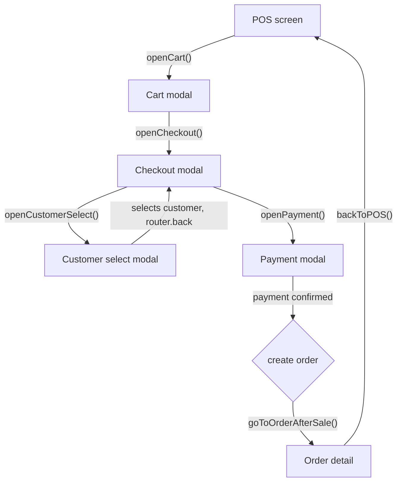
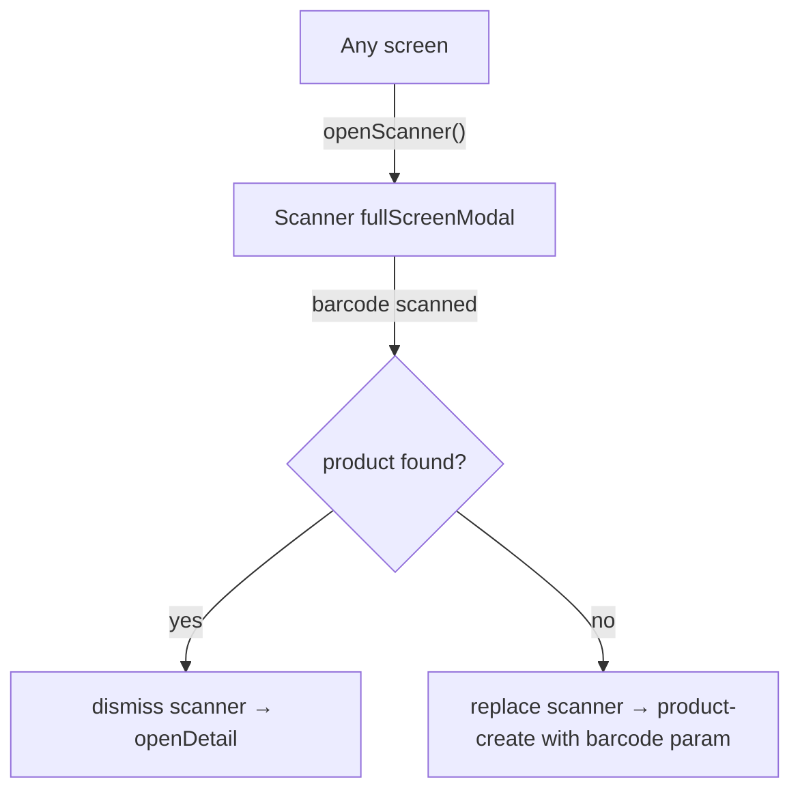
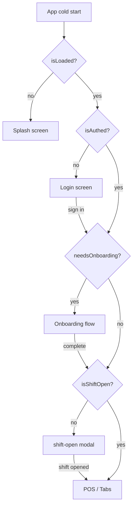

# Navigation Architecture — Ayphen Retail Mobile

Complete reference for Expo Router navigation. Every flow, pattern, and decision documented in one place.

---

## Table of contents

1. [Core mental model](#1-core-mental-model)
2. [Complete folder structure](#2-complete-folder-structure)
3. [Architecture Decision Records](#3-architecture-decision-records)
4. [Authentication — Stack.Protected (primary)](#4-authentication--stackprotected-primary)
5. [RBAC route control](#5-rbac-route-control)
6. [ROUTES constants](#6-routes-constants)
7. [Navigation Service](#7-navigation-service)
8. [Navigation methods reference](#8-navigation-methods-reference)
9. [Tabs — hiding the bar and stale state](#9-tabs--hiding-the-bar-and-stale-state)
10. [Modal screens](#10-modal-screens)
11. [Deep linking](#11-deep-linking)
12. [Passing data between screens](#12-passing-data-between-screens)
13. [Guards — unsaved changes and back button](#13-guards--unsaved-changes-and-back-button)
14. [Navigation flows](#14-navigation-flows)
15. [Error boundaries](#15-error-boundaries)
16. [Performance](#16-performance)
17. [Testing](#17-testing)
18. [Anti-patterns](#18-anti-patterns)
19. [Version compatibility](#19-version-compatibility)
20. [Migration from React Navigation](#20-migration-from-react-navigation)
21. [Complete role-based route table](#21-complete-role-based-route-table)
22. [The 12 rules](#22-the-12-rules)
23. [Appendix A — Legacy auth (SDK ≤ 52)](#appendix-a--legacy-auth-sdk--52)

---

## 1. Core mental model

Expo Router is file-system routing. The folder structure inside `app/` **is** the navigation structure.

```
File system rule:
  Every file in app/           = one route
  Every _layout.tsx            = one navigator (Stack, Tabs, Drawer)
  (parentheses) folder name    = route group — logical grouping, no URL segment
  [squareBrackets] file name   = dynamic segment — value available as param
  +not-found.tsx               = catch-all 404
  ErrorBoundary export         = error boundary for a subtree (named export from any _layout.tsx)
  +native-intent.tsx           = native deep-link rewrite hook (advanced)
```

Three navigator types used in this app:

| Navigator | Use for |
|---|---|
| `Stack` | Drilled-down detail screens, forms, product edit. Back button and swipe-to-go-back work. |
| `Tabs` | Main app sections. Each tab keeps its own independent Stack. |
| `Modal` | Overlaid above current screen. Dismissed with swipe or explicit close. |

**Critical behaviour:** a `Stack` nested *inside* `Tabs` does **not** cover the tab bar when you push a child. The tab bar is owned by `Tabs` and sits below its content area. Hiding it requires explicit configuration — see [§9](#9-tabs--hiding-the-bar-and-stale-state).

---

## 2. Complete folder structure

### Three-layer separation

```
Layer 1 — app/(auth)/
  Unauthenticated screens only. No tab bar.

Layer 2 — app/(onboarding)/
  Post-auth setup. Profile incomplete or store not yet created. No tab bar.

Layer 3 — app/(store)/
  Fully authenticated. Route hierarchy reflects business domain.
  RBAC decides access — roles do not shape the route tree.

  Zone A — (store)/(main)/(tabs)/
    Tab-bar screens. The tab bar is rendered here.
    Controlled via useSegments() in (tabs)/_layout.tsx.

  Zone B — modals declared in (store)/_layout.tsx
    Cart, checkout, scanner, product-create, shift open/close.
    These render OVER the tab bar because (store) is an ancestor of (tabs).
```

### Two techniques to cover the tab bar

**Technique A — Present as a modal from a parent navigator** *(preferred for screens opened from multiple places)*
Declare in `(store)/_layout.tsx` with `presentation: 'modal'`. Because `(store)` is an ancestor of `(tabs)`, the modal covers the tab bar on both platforms.

**Technique B — Keep in the tab's Stack and explicitly hide the bar**
If the screen belongs to one tab's drill-down (product detail → edit), hide the bar via `useSegments()` in `(tabs)/_layout.tsx`.

### Annotated folder tree

```
app/
├── _layout.tsx                   Root: GestureHandler → SafeArea → Redux → BottomSheet → Toast
├── +not-found.tsx
│
├── (auth)/
│   ├── _layout.tsx               Stack.Protected guard={!isAuthed}
│   ├── login.tsx
│   ├── register.tsx
│   └── forgot-password.tsx
│
├── (onboarding)/
│   ├── _layout.tsx               Stack.Protected guard={isAuthed && needsOnboarding}
│   ├── profile-setup.tsx
│   ├── store-setup.tsx
│   └── subscription.tsx
│
└── (store)/
    ├── _layout.tsx               Stack; declares all store-domain modals (Technique A)
    ├── cart.tsx                  presentation: 'modal'
    ├── checkout.tsx              presentation: 'modal', gestureEnabled: false
    ├── payment.tsx               presentation: 'modal', gestureEnabled: false
    ├── product-create.tsx        presentation: 'modal'
    ├── pos-scanner.tsx           presentation: 'fullScreenModal', gestureEnabled: false
    ├── shift-open.tsx            presentation: 'modal', gestureEnabled: false
    ├── shift-close.tsx           presentation: 'modal', gestureEnabled: false
    ├── customer-select.tsx       presentation: 'modal'
    ├── feature-locked.tsx        presentation: 'modal'
    ├── subscription-ended.tsx    presentation: 'modal', gestureEnabled: false
    │
    ├── analytics/
    │   ├── _layout.tsx           RBAC guard: Analytics.view
    │   ├── index.tsx
    │   ├── sales.tsx
    │   └── audit-log.tsx
    │
    └── (main)/
        ├── _layout.tsx           Shift gate → redirect to shift-open if no active shift
        └── (tabs)/
            ├── _layout.tsx       All Tabs.Screen entries; tab bar driven by useSegments()
            ├── index.tsx         Home — tab bar VISIBLE
            ├── pos/
            │   ├── _layout.tsx
            │   └── index.tsx     POS main — tab bar VISIBLE
            ├── products/
            │   ├── _layout.tsx
            │   ├── index.tsx     Product list — tab bar VISIBLE
            │   └── [guuid]/
            │       ├── index.tsx Detail — tab bar HIDDEN (Technique B)
            │       └── edit.tsx  Edit — tab bar HIDDEN (Technique B)
            ├── orders/
            │   ├── _layout.tsx
            │   ├── index.tsx     Orders list — tab bar VISIBLE
            │   └── [guuid]/
            │       └── index.tsx Detail — tab bar HIDDEN (Technique B)
            ├── reports/          href: null — hidden from bar; RBAC guarded
            ├── settings/         href: null — hidden from bar; RBAC guarded
            └── more/
                ├── _layout.tsx   Explicit Stack.Screen declarations (avoid auto-register)
                ├── index.tsx     More grid — tab bar VISIBLE
                ├── customers/    index, create, [guuid]/index, [guuid]/edit
                ├── suppliers/    index, [guuid]/index
                └── shifts/       index, [guuid]/edit

features/                         All feature logic. Route files are thin wrappers only.
├── pos/        screens, components, hooks, store/cartStore.ts (Zustand)
├── checkout/   screens, store/checkoutStore.ts (Zustand)
├── products/
│   ├── screens/
│   ├── components/
│   ├── hooks/
│   ├── api/
│   ├── navigation/               feature-local navigation helpers (if needed)
│   ├── store/
│   └── types/
├── orders/
├── analytics/
├── customers/
└── settings/
```

> **Route file thin wrapper pattern:** every file in `app/` imports its screen from `features/`. Route files contain no business logic.

```typescript
// app/(store)/(main)/(tabs)/pos/index.tsx
export { POSScreen as default } from '@/features/pos/screens/POSScreen';

// app/(store)/(main)/(tabs)/products/[guuid]/index.tsx
import { useLocalSearchParams } from 'expo-router';
import { ProductDetailScreen } from '@/features/products/screens/ProductDetailScreen';

export default function ProductDetailRoute() {
  const { guuid } = useLocalSearchParams<{ guuid: string }>();
  return <ProductDetailScreen productGuuid={guuid} />;
}
```

---

## 3. Architecture Decision Records

These records explain *why* the architecture is the way it is. Read them before proposing structural changes.

### ADR-01 — Business-domain routing, not role-based folders

**Decision:** All routes live under a single business-domain hierarchy. There is no `(owner)/`, `(manager)/`, or `(cashier)/` folder.

**Rejected alternative:** Separate folder groups per role.

**Reason:** Roles change frequently. If a route lives in `(owner)/analytics`, moving it when the Manager role gains analytics access requires renaming the folder and updating every `router.push` call that referenced it. Business domains (products, orders, analytics) are stable — they don't move when permissions change.

**Consequence:** RBAC is enforced by guards ([§5](#5-rbac-route-control)), not folder placement.

---

### ADR-02 — Stack.Protected as the primary auth mechanism

**Decision:** Use `Stack.Protected` (Expo SDK 53+) for all auth and onboarding guards.

**Rejected alternative:** Imperative `useEffect` + `router.replace` routing.

**Reason:** `useEffect` fires after the first render, causing a visible flash of the protected screen before the redirect. `Stack.Protected` evaluates guards as part of navigation and avoids this in the common case.

**Caveat:** `Stack.Protected` is client-side navigation control only — it is **not** a server-side access check. There is also a known iOS issue (expo/expo #37305) where the protected screen can briefly appear before the guard redirects. The `<Redirect>` pattern in Appendix A remains the reliable fallback when this surfaces.

**Consequence:** Targets SDK 53+. Teams on SDK ≤ 52 use the `<Redirect>` pattern. See [Appendix A](#appendix-a--legacy-auth-sdk--52).

---

### ADR-03 — Store-level modals, not root-level modals

**Decision:** Store-domain modals (cart, checkout, scanner) are declared in `(store)/_layout.tsx`, not in `app/_layout.tsx`.

**Rejected alternative:** All modals in the root layout.

**Reason:** Colocation. The cart and checkout belong to the store experience, not to the global app shell. Root-level declarations create an inconsistency where the store layout needed `<Slot />` but `<Slot />` cannot carry `presentation` options — a `Stack` is required. Store-level modals cover the tab bar because `(store)` is an ancestor of `(tabs)`.

**Consequence:** If a modal renders behind content on Android (rare, version-dependent), lift its `Stack.Screen` to the root layout using the fully-qualified name (`name="(store)/cart"`).

---

### ADR-04 — ROUTES constants, not raw strings

**Decision:** All route strings are defined in `navigation/routes.ts` and referenced via `ROUTES.*`.

**Rejected alternative:** Inline route strings everywhere.

**Reason:** A single typo in a raw route string causes a silent navigation to `+not-found` in production. With typed routes enabled, TypeScript catches invalid paths at compile time; `ROUTES` constants provide an ergonomic, autocomplete-friendly layer on top.

**Consequence:** Every `router.push`, `router.replace`, and `Link href` in feature code must use `ROUTES.*`. Raw strings are only permitted inside `navigation/routes.ts` itself.

---

### ADR-05 — Split NavigationService by domain

**Decision:** NavigationService is split into domain-specific files (`authNavigation.ts`, `productNavigation.ts`, etc.) with a barrel `index.ts`.

**Rejected alternative:** Single `NavigationService.ts` for all navigation actions.

**Reason:** A single service grows to 500+ lines as the app adds screens. Individual imports become impossible — you import the entire service for one action. Domain files are individually testable and co-located with the feature logic they serve.

**Consequence:** See [§7](#7-navigation-service) for the full split structure.

---

## 4. Authentication — Stack.Protected (primary)

> **This section covers SDK 53+ only.** For SDK ≤ 52, see [Appendix A](#appendix-a--legacy-auth-sdk--52).

> **⚠️ Auth-method note:** The `(auth)` group below is scaffolded for **email/username + password** (`login`, `register`, `forgot-password`). If this app authenticates with **phone + OTP** instead, that flow needs its own screens — typically `(auth)/phone.tsx` (enter number) → `(auth)/verify-otp.tsx` (enter code) — and the `register`/`forgot-password` screens drop out. The routing/guard architecture in this section is identical either way; only the screens inside `(auth)` and the `signIn()` implementation change. Pick the model that matches the product spec and keep the `(auth)` folder, `ROUTES`, and bootstrap consistent with it.

### Bootstrap chain

```typescript
// app/_layout.tsx
import { Stack } from 'expo-router';
import { GestureHandlerRootView } from 'react-native-gesture-handler';
import { SafeAreaProvider } from 'react-native-safe-area-context';
import { Provider as ReduxProvider } from 'react-redux';
import { store } from '@/store';
import { BottomSheetProvider } from '@/context/BottomSheetContext';
import { ToastProvider } from '@/context/ToastContext';
import { AppBootstrap } from '@/core/bootstrap/AppBootstrap';
import { useAppGuards } from '@/core/routing/useAppGuards';
import * as ExpoSplashScreen from 'expo-splash-screen';
import { useEffect } from 'react';
import * as ExpoFont from 'expo-font';

ExpoSplashScreen.preventAutoHideAsync();

function RootNavigator() {
  const { isAuthed, needsOnboarding, hasStore } = useAppGuards();

  return (
    <Stack screenOptions={{ headerShown: false }}>
      {/* Unauthenticated — show only (auth) */}
      <Stack.Protected guard={!isAuthed}>
        <Stack.Screen name="(auth)" options={{ animation: 'none' }} />
      </Stack.Protected>

      {/* Authenticated but onboarding incomplete */}
      <Stack.Protected guard={isAuthed && needsOnboarding}>
        <Stack.Screen name="(onboarding)" options={{ animation: 'none' }} />
      </Stack.Protected>

      {/* Fully authenticated */}
      <Stack.Protected guard={isAuthed && !needsOnboarding && hasStore}>
        <Stack.Screen name="(store)" options={{ animation: 'none' }} />
      </Stack.Protected>
    </Stack>
  );
}

export default function RootLayout() {
  const [fontsLoaded] = ExpoFont.useFonts({ /* font map */ });

  useEffect(() => {
    if (fontsLoaded) ExpoSplashScreen.hideAsync();
  }, [fontsLoaded]);

  if (!fontsLoaded) return null;

  return (
    <GestureHandlerRootView style={{ flex: 1 }}>
      <SafeAreaProvider>
        <ReduxProvider store={store}>
          <AppBootstrap>
            <BottomSheetProvider>
              <ToastProvider>
                <RootNavigator />
              </ToastProvider>
            </BottomSheetProvider>
          </AppBootstrap>
        </ReduxProvider>
      </SafeAreaProvider>
    </GestureHandlerRootView>
  );
}
```

```typescript
// core/bootstrap/AppBootstrap.tsx
export function AppBootstrap({ children }: { children: React.ReactNode }) {
  const dispatch = useDispatch();
  const { status } = useSelector((s: RootState) => s.auth);

  useEffect(() => { dispatch(loadAuthFromStorage()); }, []);

  if (status === 'loading') return null;  // splash still visible
  return <>{children}</>;
}
```

```typescript
// core/routing/useAppGuards.ts
// SINGLE SOURCE OF TRUTH: all auth/identity state lives in the Redux `auth` slice.
// Do NOT read auth from a separate Zustand store here — that splits identity across
// two stores and causes guard/Redux desync (guard says authed while Redux still loads).
export function useAppGuards() {
  const { isSignedIn, isLoaded } = useSelector((s: RootState) => s.auth);
  const isProfileComplete = useSelector(selectIsProfileComplete);
  const activeStore       = useSelector(selectActiveStore);

  return {
    isAuthed:        isLoaded && isSignedIn,
    needsOnboarding: !isProfileComplete || !activeStore,
    hasStore:        !!activeStore,
  };
}
```

### Store layout — shift gate and modals

```typescript
// app/(store)/_layout.tsx
import { Stack } from 'expo-router';

export default function StoreLayout() {
  return (
    <Stack screenOptions={{ headerShown: false }}>
      <Stack.Screen name="(main)" options={{ animation: 'none' }} />

      {/* Store-domain modals — Technique A, all cover the tab bar */}
      <Stack.Screen name="cart"             options={{ presentation: 'modal' }} />
      <Stack.Screen name="checkout"         options={{ presentation: 'modal', gestureEnabled: false }} />
      <Stack.Screen name="payment"          options={{ presentation: 'modal', gestureEnabled: false }} />
      <Stack.Screen name="customer-select"  options={{ presentation: 'modal' }} />
      <Stack.Screen name="product-create"   options={{ presentation: 'modal' }} />
      <Stack.Screen name="pos-scanner"      options={{ presentation: 'fullScreenModal', gestureEnabled: false }} />
      <Stack.Screen name="shift-open"       options={{ presentation: 'modal', gestureEnabled: false }} />
      <Stack.Screen name="shift-close"      options={{ presentation: 'modal', gestureEnabled: false }} />
      <Stack.Screen name="feature-locked"   options={{ presentation: 'modal' }} />
      <Stack.Screen name="subscription-ended" options={{ presentation: 'modal', gestureEnabled: false }} />
      <Stack.Screen name="analytics"        options={{ headerShown: false }} />
    </Stack>
  );
}
```

```typescript
// app/(store)/(main)/_layout.tsx — shift gate
import { Redirect, Stack } from 'expo-router';
import { useSelector } from 'react-redux';
import { selectIsShiftOpen } from '@/store/selectors';

export default function MainLayout() {
  const isShiftOpen = useSelector(selectIsShiftOpen);

  // OR: wrap the (tabs) screen in Stack.Protected guard={isShiftOpen}
  if (!isShiftOpen) return <Redirect href={ROUTES.shiftOpen} />;

  return <Stack screenOptions={{ headerShown: false }} />;
}
```

### Why `animation: 'none'` on group screens

Without it, a brief slide-in appears on every cold start as the router resolves into `(store)`. It looks like a bug. Setting `animation: 'none'` makes the transition invisible.

### Auth decision tree

```
App launches
  ├── isLoaded = false → show splash, render nothing
  └── isLoaded = true
        ├── !isAuthed              → (auth): login / register / forgot-password
        └── isAuthed = true
              ├── needsOnboarding  → (onboarding)/profile-setup → store-setup → subscription
              └── hasStore = true
                    ├── !isShiftOpen → (store)/shift-open  [modal]
                    └── isShiftOpen  → (store)/(main)/(tabs)
```

Each band maps to one `Stack.Protected` guard. When a guard flips, the router redirects to the nearest accessible anchor automatically.

---

## 5. RBAC route control

### Three enforcement layers

**Layer 1 — Navigator guard** (blocks a whole section): `Stack.Protected` or a layout-level `<Redirect>`.

```typescript
// app/(store)/analytics/_layout.tsx
import { Stack } from 'expo-router';
import { usePermissions } from '@/core/permissions';

export default function AnalyticsLayout() {
  const { can } = usePermissions();
  return (
    <Stack screenOptions={{ headerShown: false }}>
      <Stack.Protected guard={can('Analytics', 'view')}>
        <Stack.Screen name="index"     />
        <Stack.Screen name="sales"     />
        <Stack.Screen name="audit-log" />
      </Stack.Protected>
    </Stack>
  );
}
```

**Layer 2 — Screen hook** (action-level control):

```typescript
export default function ProductDetailScreen() {
  const { can } = usePermissions();
  return (
    <View>
      <ProductInfo />
      {can('Product', 'edit')   && <Button label="Edit"   onPress={handleEdit}   />}
      {can('Product', 'delete') && <Button label="Delete" onPress={handleDelete} />}
    </View>
  );
}
```

**Layer 3 — Tab visibility** (removes a tab from the bar; does NOT block the route):

```typescript
// href: undefined → tab visible; href: null → tab removed from the bar
href: can('Report', 'view') ? undefined : null
```

> Layer 3 alone never blocks a route. Always pair with Layer 1 or `Stack.Protected`.

### Permission types and snapshot

A role is a default template. Admins may grant/revoke individual permissions, so the effective permissions are stored as a **snapshot** in Redux.

```typescript
// core/permissions/permissions.types.ts
export type Role = 'owner' | 'manager' | 'cashier';
export type PermissionEntity =
  | 'Product' | 'Order' | 'Customer' | 'TaxRate' | 'Report'
  | 'Analytics' | 'Shift' | 'Staff' | 'Store';
export type PermissionAction = 'view' | 'create' | 'edit' | 'delete' | 'manage';
export type PermissionSnapshot = Partial<
  Record<PermissionEntity, Partial<Record<PermissionAction, boolean>>>
>;
```

```typescript
// core/permissions/permission-matrix.ts
export const PERMISSION_MATRIX: Record<Role, PermissionSnapshot> = {
  owner: {
    Product:   { view:true, create:true, edit:true,  delete:true  },
    Order:     { view:true, create:true, edit:true,  delete:true  },
    Customer:  { view:true, create:true, edit:true,  delete:true  },
    TaxRate:   { view:true, create:true, edit:true,  delete:true  },
    Report:    { view:true },
    Analytics: { view:true },
    Shift:     { manage:true },
    Staff:     { view:true, create:true, edit:true, delete:true },
    Store:     { manage:true },
  },
  manager: {
    Product:   { view:true, create:true, edit:true,  delete:false },
    Order:     { view:true, create:true, edit:true,  delete:false },
    Customer:  { view:true, create:true, edit:true,  delete:false },
    TaxRate:   { view:true, create:false, edit:false, delete:false },
    Report:    { view:true },
    Analytics: { view:false },
    Shift:     { manage:true },
    Staff:     { view:true, create:false, edit:false, delete:false },
    Store:     { manage:false },
  },
  cashier: {
    Product:   { view:true, create:false, edit:false, delete:false },
    Order:     { view:true, create:true,  edit:false, delete:false },
    Customer:  { view:true, create:true,  edit:false, delete:false },
    TaxRate:   { view:false },
    Report:    { view:false },
    Analytics: { view:false },
    Shift:     { manage:false },
    Staff:     { view:false },
    Store:     { manage:false },
  },
};
```

```typescript
// core/permissions/usePermissions.ts
export function usePermissions() {
  const role       = useSelector((s: RootState) => s.auth.role) as Role;
  const snapshot   = useSelector((s: RootState) => s.auth.permissionSnapshot);
  const permissions = snapshot ?? PERMISSION_MATRIX[role];
  const can = (entity: PermissionEntity, action: PermissionAction): boolean =>
    permissions?.[entity]?.[action] === true;
  return { role, can };
}
```

---

## 6. ROUTES constants

Define all route strings in one place. Every `router.push`, `router.replace`, and `Link href` in feature code **must** use `ROUTES.*`.

```typescript
// navigation/routes.ts

const STORE_TABS = '/(store)/(main)/(tabs)';

export const ROUTES = {
  // Auth
  login:          '/(auth)/login'             as const,
  register:       '/(auth)/register'          as const,
  forgotPassword: '/(auth)/forgot-password'   as const,

  // Onboarding
  profileSetup:   '/(onboarding)/profile-setup'  as const,
  storeSetup:     '/(onboarding)/store-setup'    as const,
  subscription:   '/(onboarding)/subscription'   as const,

  // Store — tab roots
  pos:            `${STORE_TABS}/pos`          as const,
  productList:    `${STORE_TABS}/products`     as const,
  orderList:      `${STORE_TABS}/orders`       as const,
  more:           `${STORE_TABS}/more`         as const,

  // Store — dynamic tab screens
  productDetail:  (guuid: string) => `${STORE_TABS}/products/${guuid}`,
  productEdit:    (guuid: string) => `${STORE_TABS}/products/${guuid}/edit`,
  orderDetail:    (guuid: string) => `${STORE_TABS}/orders/${guuid}`,
  customerDetail: (guuid: string) => `${STORE_TABS}/more/customers/${guuid}`,
  customerEdit:   (guuid: string) => `${STORE_TABS}/more/customers/${guuid}/edit`,
  customerCreate: `${STORE_TABS}/more/customers/create` as const,
  supplierDetail: (guuid: string) => `${STORE_TABS}/more/suppliers/${guuid}`,

  // Store — modals (Technique A)
  cart:             '/(store)/cart'              as const,
  checkout:         '/(store)/checkout'          as const,
  payment:          '/(store)/payment'           as const,
  customerSelect:   '/(store)/customer-select'   as const,
  productCreate:    '/(store)/product-create'    as const,
  posScanner:       '/(store)/pos-scanner'       as const,
  shiftOpen:        '/(store)/shift-open'        as const,
  shiftClose:       '/(store)/shift-close'       as const,
  featureLocked:    '/(store)/feature-locked'    as const,
  subscriptionEnded:'/(store)/subscription-ended' as const,

  // Analytics
  analytics:        '/(store)/analytics'         as const,
  analyticsSales:   '/(store)/analytics/sales'   as const,
  auditLog:         '/(store)/analytics/audit-log' as const,
} as const;
```

---

## 7. Navigation Service

### Domain-split file structure

```
navigation/
├── routes.ts              ROUTES constants (see §6)
├── authNavigation.ts      login, logout, session expiry
├── posNavigation.ts       cart, checkout, payment, scanner
├── productNavigation.ts   product detail, edit, create
├── orderNavigation.ts     order detail, post-sale redirect
├── customerNavigation.ts  customer detail, create, select
├── analyticsNavigation.ts analytics screens
└── index.ts               barrel — re-exports everything as NavigationService
```

### authNavigation.ts

```typescript
// navigation/authNavigation.ts
import { router } from 'expo-router';
import { ROUTES } from './routes';

// Validate a returnTo deep-link param before redirecting to it. Only same-app store
// paths are allowed; anything else (external schemes, auth/onboarding loops, junk)
// falls back to POS. Decode first, then check.
function safeReturnTo(returnTo?: string): string {
  if (!returnTo) return ROUTES.pos;
  let target: string;
  try {
    target = decodeURIComponent(returnTo);
  } catch {
    return ROUTES.pos;            // malformed encoding
  }
  // Must be an in-app store path. Reject absolute URLs, custom schemes, and
  // anything that would re-enter the auth/onboarding flow.
  const isStorePath = target.startsWith('/(store)');
  return isStorePath ? target : ROUTES.pos;
}

export const authNavigation = {
  goToLogin: () => {
    router.dismissAll();
    router.replace(ROUTES.login);
  },

  goToStoreAfterLogin: (returnTo?: string) => {
    // SECURITY: never replace() to a raw deep-link param. A crafted link could push
    // the user anywhere post-login. Only honour returnTo if it resolves to a known
    // in-store route; otherwise fall back to POS.
    router.replace(safeReturnTo(returnTo));
  },

  logout: async (signOut: () => Promise<void>) => {
    await signOut();
    router.dismissAll();
    router.replace(ROUTES.login);
  },

  handleSessionExpiry: () => {
    router.dismissAll();
    router.replace(ROUTES.login);
  },
};
```

### posNavigation.ts

```typescript
// navigation/posNavigation.ts
import { router } from 'expo-router';
import { ROUTES } from './routes';

export const posNavigation = {
  openCart:           () => router.push(ROUTES.cart),
  openCheckout:       () => router.push(ROUTES.checkout),
  openPayment:        () => router.push(ROUTES.payment),
  openScanner:        () => router.push(ROUTES.posScanner),
  openCustomerSelect: () => router.push(ROUTES.customerSelect),
  openShiftOpen:      () => router.push(ROUTES.shiftOpen),
  openShiftClose:     () => router.push(ROUTES.shiftClose),
  backToPOS:          () => router.replace(ROUTES.pos),
};
```

### productNavigation.ts

```typescript
// navigation/productNavigation.ts
import { router } from 'expo-router';
import { ROUTES } from './routes';

export const productNavigation = {
  openDetail: (guuid: string) => router.push(ROUTES.productDetail(guuid)),
  openEdit:   (guuid: string) => router.push(ROUTES.productEdit(guuid)),
  openCreate: (params?: { barcode?: string; categoryGuuid?: string }) =>
    router.push({ pathname: ROUTES.productCreate, params: params ?? {} }),
};
```

### orderNavigation.ts

```typescript
// navigation/orderNavigation.ts
import { router } from 'expo-router';
import { ROUTES } from './routes';

export const orderNavigation = {
  openDetail: (guuid: string) => router.push(ROUTES.orderDetail(guuid)),

  // Use after a sale: dismiss checkout/payment modals, then land on the order
  goToOrderAfterSale: (guuid: string) => {
    router.dismissAll();
    router.replace(ROUTES.orderDetail(guuid));
  },
};
```

### analyticsNavigation.ts

```typescript
// navigation/analyticsNavigation.ts
import { router } from 'expo-router';
import { ROUTES } from './routes';

export const analyticsNavigation = {
  open:      () => router.push(ROUTES.analytics),
  openSales: () => router.push(ROUTES.analyticsSales),
  openAudit: () => router.push(ROUTES.auditLog),
};
```

### index.ts — barrel

```typescript
// navigation/index.ts
export { authNavigation }      from './authNavigation';
export { posNavigation }       from './posNavigation';
export { productNavigation }   from './productNavigation';
export { orderNavigation }     from './orderNavigation';
export { customerNavigation }  from './customerNavigation';
export { analyticsNavigation } from './analyticsNavigation';

// Composed object for legacy call-sites
import { authNavigation }      from './authNavigation';
import { posNavigation }       from './posNavigation';
import { productNavigation }   from './productNavigation';
import { orderNavigation }     from './orderNavigation';
import { customerNavigation }  from './customerNavigation';
import { analyticsNavigation } from './analyticsNavigation';

export const NavigationService = {
  ...authNavigation,
  ...posNavigation,
  ...productNavigation,
  ...orderNavigation,
  ...customerNavigation,
  ...analyticsNavigation,
};
```

### When to use `router.*` vs `NavigationService`

| Scenario | Use |
|---|---|
| Simple UI navigation inside a React component | `router.push(ROUTES.x)` directly |
| Redux thunks / async actions | `NavigationService.*` (or the domain file directly) |
| API interceptors (session expiry) | `authNavigation.handleSessionExpiry()` |
| Background tasks outside React | `NavigationService.*` |
| Multi-step business workflows shared across features | `NavigationService.*` |

> **Rule:** if the navigation action is local to a single component and has no re-use, use `router.*` with `ROUTES.*`. Reach for `NavigationService` when the action is a business workflow, is called from non-component code, or is shared across multiple call-sites.

---

## 8. Navigation methods reference

| Method | Use when |
|---|---|
| `router.push(ROUTES.x)` | Forward navigation; user should be able to go back. |
| `router.replace(ROUTES.x)` | After a flow completes where back into it would be wrong (login, order done). |
| `router.back()` | Standard back — **always guard with `canGoBack()`** on deep-linkable screens. |
| `router.dismiss()` | Close the current modal. |
| `router.dismissAll()` | Close all modals — **call before every root-level redirect**. |
| `router.dismissTo(ROUTES.x)` | Dismiss back to a specific route (SDK 53+). |
| `<Link href={ROUTES.x}>` | Declarative navigation inside JSX with a static target. |
| `<Redirect href={ROUTES.x}>` | Conditional redirect from layout/screen with no flash frame. |
| `useNavigation()` | Low-level: `popToTop`, event listeners, `setOptions`. |

```typescript
// Safe back — required on any deep-linkable screen
const safeBack = () => {
  if (navigation.canGoBack()) router.back();
  else router.replace(ROUTES.pos);
};
```

```typescript
// After logout — close modals first
await signOut();
router.dismissAll();
router.replace(ROUTES.login);
```

```typescript
// Tab re-tap → pop to root
<Tabs.Screen
  name="products"
  listeners={({ navigation }) => ({
    tabPress: (e) => {
      if (navigation.isFocused()) {
        e.preventDefault();
        navigation.popToTop();
      }
    },
  })}
/>
```

---

## 9. Tabs — hiding the bar and stale state

The tab bar is **not** hidden automatically. Drive `tabBarStyle.display` from the current route segments.

```typescript
// app/(store)/(main)/(tabs)/_layout.tsx
import { Tabs, useSegments } from 'expo-router';
import { usePermissions } from '@/core/permissions';

const HIDE_TAB_BAR_ON = new Set([
  '[guuid]',   // product/order/customer/supplier detail
  'edit',
  'create',
  'stock',
  'ledger',
]);

export default function TabsLayout() {
  const segments  = useSegments();
  const { can }   = usePermissions();
  const leaf      = segments[segments.length - 1];
  const hideTabBar = HIDE_TAB_BAR_ON.has(leaf);

  return (
    <Tabs
      screenOptions={{
        headerShown: false,
        tabBarHideOnKeyboard: true,
        tabBarStyle: hideTabBar ? { display: 'none' } : undefined,
      }}
    >
      <Tabs.Screen name="index"    options={{ title: 'Home'     }} />
      <Tabs.Screen name="pos"      options={{ title: 'POS'      }} />
      <Tabs.Screen name="products" options={{ title: 'Products', href: can('Product','view') ? undefined : null }} />
      <Tabs.Screen name="orders"   options={{ title: 'Orders',   href: can('Order','view')   ? undefined : null }} />
      <Tabs.Screen name="more"     options={{ title: 'More'     }} />
      <Tabs.Screen name="reports"  options={{ href: null }} />
      <Tabs.Screen name="settings" options={{ href: null }} />
    </Tabs>
  );
}
```

> **Caveat:** `display: 'none'` can briefly reserve the bar's height during the push animation on some `react-native-screens` versions. If you see a flicker, use Technique A (present the screen as a modal from `(store)`) instead.

**Per-tab stack state:** each tab maintains its own stack across switches. Leaving Products for Orders and coming back returns you to the same Products screen. This is why Technique B (hide in place) is preferable to Technique A for screens belonging to a single tab's drill-down.

---

## 10. Modal screens

Declare modals in a navigator that is an **ancestor of every screen they must cover**. See [§2 ADR-03](#adr-03--store-level-modals-not-root-level-modals) for why `(store)/_layout.tsx` is the right anchor.

```
presentation values:
  'modal'            — slides up (iOS card). Standard for forms, pickers.
  'fullScreenModal'  — covers the entire screen. Camera, scanner, signature.
  'transparentModal' — transparent background, renders over current screen.
  'containedModal'   — contained within the current view hierarchy.
```

```typescript
// Open / close
router.push(ROUTES.productCreate);
router.push({ pathname: ROUTES.productCreate, params: { barcode: scannedValue } });
router.dismiss();      // close the topmost modal
router.dismissAll();   // close all modals in the stack
```

Prevent accidental swipe-dismissal while dirty:

```typescript
useEffect(() => {
  navigation.setOptions({ gestureEnabled: !isDirty });
}, [navigation, isDirty]);
```

> **Android z-order:** if a modal declared at `(store)` level renders behind tab content on Android, lift that `Stack.Screen` to `app/_layout.tsx` using its fully-qualified name (`name="(store)/cart"`). Start at `(store)` level; escalate only if you observe the bug.

---

## 11. Deep linking

```json
// app.json
{
  "expo": {
    "scheme": "ayphenretail",
    "plugins": [["expo-router", { "typedRoutes": true }]],
    "android": {
      "intentFilters": [
        { "action": "VIEW", "data": [{ "scheme": "ayphenretail" }], "category": ["BROWSABLE", "DEFAULT"] }
      ]
    }
  }
}
```

### Back behaviour on cold deep link — `initialRouteName`

When the app opens directly on a detail screen the back stack is empty. Set an anchor so Back returns to the list:

```typescript
// app/(store)/(main)/(tabs)/products/_layout.tsx
export const unstable_settings = {
  initialRouteName: 'index',  // loads index under any deep-linked child
};
```

`initialRouteName` only applies on deep links. For in-app navigation use `<Link withAnchor>` or `router.push(href, { withAnchor: true })`.

### Auth-protected deep links — `returnTo` pattern

Expo Router does **not** auto-replay a protected deep-link destination after a login redirect. Preserve it manually:

```typescript
// In the guard
import { usePathname } from 'expo-router';
const pathname = usePathname();
if (!isSignedIn) {
  return <Redirect href={`${ROUTES.login}?returnTo=${encodeURIComponent(pathname)}`} />;
}

// In the login screen
const { returnTo } = useLocalSearchParams<{ returnTo?: string }>();
const onSuccess = async () => {
  await signIn();
  authNavigation.goToStoreAfterLogin(returnTo);  // validates returnTo internally
};
```

> **Security:** `returnTo` arrives from a URL the user (or an attacker) can craft. Never feed it straight into `router.replace()`. `goToStoreAfterLogin` runs it through `safeReturnTo()`, which decodes it and only allows in-app `/(store)` paths — everything else falls back to POS. This prevents a malicious deep link from steering a freshly-authenticated user to an unintended screen.

### `+native-intent.tsx`

For non-URL launch payloads or third-party link rewriting. Runs **outside** React context — no access to auth state. Use for path rewriting only, not for auth decisions. Never throw inside it; return an error route instead.

---

## 12. Passing data between screens

Route params are always strings. Never serialise objects into params.

### Pattern 1 — Pass identifier, fetch in destination (preferred)

```typescript
router.push(ROUTES.productDetail(product.guuid));

// destination:
const { guuid } = useLocalSearchParams<{ guuid: string }>();
const product   = useProductByGuuid(storeId, guuid);  // fetch from SQLite
```

### Pattern 2 — Shared Zustand state for multi-step flows

```typescript
// features/checkout/store/checkoutStore.ts
export const useCheckoutStore = create<CheckoutState>((set) => ({
  items: [], customer: null, paymentMethod: null,
  setCustomer: (customer)     => set({ customer }),
  setPayment:  (paymentMethod) => set({ paymentMethod }),
  reset:       ()              => set({ items: [], customer: null, paymentMethod: null }),
}));

// Customer picker writes and pops:
const onSelect = (c: CustomerRow) => {
  useCheckoutStore.getState().setCustomer(c);
  router.back();
};

// Checkout reads directly:
const { customer } = useCheckoutStore();
```

### `useLocalSearchParams` vs `useGlobalSearchParams`

```
useLocalSearchParams()  → params for this segment only (no re-renders from parent URL changes)
useGlobalSearchParams() → params for the whole URL (re-renders on every URL change app-wide)
```

Rule: always `useLocalSearchParams`.

---

## 13. Guards — unsaved changes and back button

```typescript
// hooks/useUnsavedChangesGuard.ts
export function useUnsavedChangesGuard<T extends Record<string, unknown>>(
  form: UseFormReturn<T>,
  options: { enabled?: boolean } = {},
): void {
  const navigation = useNavigation();
  const router     = useRouter();
  const enabled    = options.enabled ?? form.formState.isDirty;

  // iOS swipe-to-go-back
  useEffect(() => {
    navigation.setOptions({ gestureEnabled: !enabled });
  }, [navigation, enabled]);

  // Android hardware back
  useEffect(() => {
    if (!enabled) return;
    const sub = BackHandler.addEventListener('hardwareBackPress', () => {
      showDiscardAlert(() => { form.reset(); router.back(); });
      return true;
    });
    return () => sub.remove();
  }, [enabled, form, router]);

  // Tab switch + programmatic navigation
  useEffect(() => {
    if (!enabled) return;
    return navigation.addListener('beforeRemove', (e) => {
      e.preventDefault();
      showDiscardAlert(() => { form.reset(); navigation.dispatch(e.data.action); });
    });
  }, [enabled, navigation, form]);
}

function showDiscardAlert(onDiscard: () => void): void {
  Alert.alert('Discard changes?', 'Unsaved changes will be lost.', [
    { text: 'Keep editing', style: 'cancel' },
    { text: 'Discard', style: 'destructive', onPress: onDiscard },
  ]);
}

// Usage:
useUnsavedChangesGuard(form, {
  enabled: form.formState.isDirty && !form.formState.isSubmitting,
});
```

---

## 14. Navigation flows

### POS sale completion



```typescript
const handlePaymentConfirmed = async () => {
  const order = await createOrder(useCheckoutStore.getState());
  useCheckoutStore.getState().reset();
  orderNavigation.goToOrderAfterSale(order.guuid);  // dismissAll + replace
};
```

Why `dismissAll()` before `replace`: cart/checkout/payment are modals. Replacing the top modal directly with a deep tab route mixes navigators and gives unpredictable back behaviour.

---

### Barcode scan → product



```typescript
const handleBarcodeScanned = ({ data }: { data: string }) => {
  const product = getProductByBarcode(storeId, data);
  if (product) {
    router.dismiss();
    productNavigation.openDetail(product.guuid);
  } else {
    router.replace({ pathname: ROUTES.productCreate, params: { barcode: encodeURIComponent(data) } });
  }
};
```

---

### Auth flows



---

### Session expiry (outside React)

```typescript
// Can be called from an Axios interceptor or any non-component code
import { authNavigation } from '@/navigation/authNavigation';

export async function handleSessionExpiry(): Promise<void> {
  await clearAuthToken();
  authNavigation.handleSessionExpiry();  // dismissAll + replace login
}
```

---

## 15. Error boundaries

### `+not-found.tsx`

```typescript
// app/+not-found.tsx
export default function NotFoundScreen() {
  return (
    <>
      <Stack.Screen options={{ title: 'Not found' }} />
      <View style={styles.container}>
        <Text style={styles.title}>This screen does not exist.</Text>
        <Link href={ROUTES.pos} style={styles.link}>Go back to POS</Link>
      </View>
    </>
  );
}
```

### Subtree error boundary — `ErrorBoundary` export

There is **no `+error.tsx` special file** in Expo Router. Subtree error boundaries are created by exporting a **named `ErrorBoundary` component from that segment's `_layout.tsx`** (the same mechanism used at the root). Expo Router wraps each route, and an uncaught error bubbles to the nearest ancestor `_layout` that exports an `ErrorBoundary`.

```typescript
// app/(store)/_layout.tsx
import { View, Text, Button } from 'react-native';
import type { ErrorBoundaryProps } from 'expo-router';

// Named export — co-located with the layout it guards.
export function ErrorBoundary({ error, retry }: ErrorBoundaryProps) {
  return (
    <View style={styles.container}>
      <Text style={styles.title}>Something went wrong</Text>
      <Text style={styles.message}>{error.message}</Text>
      <Button title="Try again" onPress={retry} />
    </View>
  );
}

// The layout's default export stays as-is (the <Stack> with modals).
export default function StoreLayout() {
  /* ...unchanged... */
}
```

`retry` remounts the subtree. Errors bubble to the nearest `_layout` that exports an `ErrorBoundary`. Adding one to `(store)/_layout.tsx` catches store-domain errors without killing the entire app. A layout can export **both** a default layout component and a named `ErrorBoundary`.

### Global crash recovery

```typescript
// app/_layout.tsx
import type { ErrorBoundaryProps } from 'expo-router';

export function ErrorBoundary({ error, retry }: ErrorBoundaryProps) {
  useEffect(() => {
    // Log to Sentry/Crashlytics
    errorReporter.captureException(error);
  }, [error]);

  return (
    <View style={styles.crash}>
      <Text style={styles.title}>App crashed</Text>
      <Text style={styles.message}>Please restart the app.</Text>
      <Button title="Try again" onPress={retry} />
    </View>
  );
}
```

### Error boundary placement guide

| Level | File | Catches |
|---|---|---|
| Root | `app/_layout.tsx` → `ErrorBoundary` export | Catastrophic errors anywhere |
| Store | `app/(store)/_layout.tsx` → `ErrorBoundary` export | Store-domain screen failures |
| Feature | `app/(store)/(main)/(tabs)/products/_layout.tsx` → `ErrorBoundary` export | Product flow errors only |

---

## 16. Performance

### Lazy loading

Expo Router lazily evaluates route files by default. Every file in `app/` is only loaded when the route is first visited. Feature logic in `features/` is loaded when the route file is first rendered. No manual lazy() calls are needed.

### Tab screen freezing

Freeze inactive tab screens to reduce re-renders and memory pressure:

```typescript
// app/(store)/(main)/(tabs)/_layout.tsx
<Tabs
  screenOptions={{
    freezeOnBlur: true,          // freezes component tree when tab loses focus
    detachInactiveScreens: true, // detaches the native view (memory saving)
  }}
>
```

> `detachInactiveScreens: true` may cause a brief re-mount flash when switching back. Test for your use case — POS tab benefits from staying mounted.

### Route prefetching

```typescript
// Prefetch the orders list while on POS so the transition is instant
<Link href={ROUTES.orderList} prefetch>Orders</Link>

// Or imperatively (verify availability for your installed expo-router version —
// the <Link prefetch> prop form is the reliably-available one):
import { prefetch } from 'expo-router';
useEffect(() => { prefetch(ROUTES.orderList); }, []);
```

### Modal performance

`presentation: 'modal'` on iOS uses a native card sheet, which is hardware-accelerated. Avoid heavy renders in the modal header — they delay the sheet open animation.

### Navigation event overhead

Every `useSegments()` call subscribes to all URL changes. Keep `useSegments()` in layout files, not in leaf screens. In leaf screens, read params from `useLocalSearchParams()` instead.

---

## 17. Testing

### Unit testing navigation actions

Navigation actions in `navigation/*.ts` are pure functions that call `router.*`. Mock the `expo-router` module:

```typescript
// __tests__/navigation/productNavigation.test.ts
import { router } from 'expo-router';
import { productNavigation } from '@/navigation/productNavigation';
import { ROUTES } from '@/navigation/routes';

jest.mock('expo-router', () => ({
  router: { push: jest.fn(), replace: jest.fn(), dismissAll: jest.fn() },
}));

describe('productNavigation', () => {
  beforeEach(() => jest.clearAllMocks());

  it('openDetail pushes the product detail route', () => {
    productNavigation.openDetail('abc-123');
    expect(router.push).toHaveBeenCalledWith(ROUTES.productDetail('abc-123'));
  });

  it('openCreate with barcode includes param', () => {
    productNavigation.openCreate({ barcode: '9780201633610' });
    expect(router.push).toHaveBeenCalledWith({
      pathname: ROUTES.productCreate,
      params: { barcode: '9780201633610' },
    });
  });
});
```

### Unit testing ROUTES

```typescript
// __tests__/navigation/routes.test.ts
import { ROUTES } from '@/navigation/routes';

it('productDetail builds the correct path', () => {
  expect(ROUTES.productDetail('xyz')).toBe(
    '/(store)/(main)/(tabs)/products/xyz',
  );
});
```

### Testing guards

Test `useAppGuards` with mocked Redux state:

```typescript
import { renderHook } from '@testing-library/react-hooks';
import { useAppGuards } from '@/core/routing/useAppGuards';

const makeWrapper = (state: Partial<RootState>) => ({ children }) =>
  <Provider store={configureStore({ reducer, preloadedState: state })}>{children}</Provider>;

it('returns needsOnboarding=true when profile is incomplete', () => {
  const { result } = renderHook(() => useAppGuards(), {
    wrapper: makeWrapper({ auth: { isSignedIn: true, isProfileComplete: false } }),
  });
  expect(result.current.needsOnboarding).toBe(true);
});
```

### Testing permission checks

```typescript
import { renderHook } from '@testing-library/react-hooks';
import { usePermissions } from '@/core/permissions';

it('cashier cannot edit products', () => {
  const { result } = renderHook(() => usePermissions(), {
    wrapper: makeWrapper({ auth: { role: 'cashier', permissionSnapshot: null } }),
  });
  expect(result.current.can('Product', 'edit')).toBe(false);
});
```

### Testing deep links

```typescript
// __tests__/navigation/deepLink.test.ts
import * as Linking from 'expo-linking';

it('fires deeplink_received analytics on incoming URL', () => {
  const trackEvent = jest.fn();
  renderWithLinkingSetup({ trackEvent });
  Linking.emit('url', { url: 'ayphenretail:///(store)/(main)/(tabs)/orders/xyz' });
  expect(trackEvent).toHaveBeenCalledWith('deeplink_received', expect.objectContaining({ url: expect.stringContaining('orders') }));
});
```

### Detox end-to-end flows

```typescript
// e2e/pos-sale.test.ts
describe('POS sale completion', () => {
  it('completes sale and lands on order detail', async () => {
    await element(by.id('pos-product-item')).tap();
    await element(by.id('add-to-cart')).tap();
    await element(by.id('view-cart')).tap();
    await waitFor(element(by.id('cart-screen'))).toBeVisible().withTimeout(2000);
    await element(by.id('checkout-button')).tap();
    await waitFor(element(by.id('checkout-screen'))).toBeVisible().withTimeout(2000);
    await element(by.id('cash-payment')).tap();
    await element(by.id('confirm-payment')).tap();
    await waitFor(element(by.id('order-detail-screen'))).toBeVisible().withTimeout(3000);
    await expect(element(by.id('order-status'))).toHaveText('Completed');
  });
});
```

```typescript
// e2e/back-button.test.ts
describe('Android back button', () => {
  it('shows discard alert on dirty form', async () => {
    await element(by.id('product-name-input')).typeText('Test');
    await device.pressBack();
    await waitFor(element(by.text('Discard changes?'))).toBeVisible().withTimeout(1000);
    await element(by.text('Discard')).tap();
    await waitFor(element(by.id('product-list-screen'))).toBeVisible().withTimeout(2000);
  });
});
```

---

## 18. Anti-patterns

### ❌ Passing whole objects in params

```typescript
// WRONG — objects are serialised to "[object Object]"
router.push({ pathname: ROUTES.productDetail('x'), params: { product: someObject } });

// CORRECT — pass the identifier; fetch in the destination
router.push(ROUTES.productDetail(product.guuid));
```

---

### ❌ Role-based folder groups

```
// WRONG
app/(owner)/analytics/
app/(cashier)/pos/

// CORRECT — domain hierarchy + RBAC
app/(store)/analytics/   ← guarded by Stack.Protected guard={can('Analytics','view')}
app/(store)/(main)/(tabs)/pos/
```

---

### ❌ Navigation in useEffect without a guard

```typescript
// WRONG — flash frame; can cause infinite loops
useEffect(() => { if (!isSignedIn) router.replace(ROUTES.login); }, [isSignedIn]);

// CORRECT
if (!isSignedIn) return <Redirect href={ROUTES.login} />;
// or: Stack.Protected guard={isSignedIn}
```

---

### ❌ Business logic in app/ route files

```typescript
// WRONG — route files are thin wrappers only
export default function ProductDetailRoute() {
  const product = useProductByGuuid(storeId, guuid);
  const handleDelete = async () => { /* 50 lines */ };
  return <View>...</View>;
}

// CORRECT — all logic lives in features/
export { ProductDetailScreen as default } from '@/features/products/screens/ProductDetailScreen';
```

---

### ❌ Calling NavigationService from repositories or domain services

```typescript
// WRONG — repositories are infrastructure; navigation is UI
class ProductRepository {
  async deleteProduct(guuid: string) {
    await db.delete(guuid);
    NavigationService.openProductList();  // ← navigation in a repository
  }
}

// CORRECT — let the call-site (screen or thunk) navigate
const handleDelete = async () => {
  await productRepository.deleteProduct(guuid);
  router.replace(ROUTES.productList);
};
```

---

### ❌ Duplicating route strings

```typescript
// WRONG — string repeated in five files; one typo causes a silent 404
router.push('/(store)/(main)/(tabs)/products');

// CORRECT — single source of truth
router.push(ROUTES.productList);
```

---

### ❌ Huge `_layout.tsx` files

Layout files should declare navigators and guards only. Any logic beyond that belongs in a hook or a service file.

---

### ❌ `router.back()` without `canGoBack()` on deep-linked screens

```typescript
// WRONG — silently does nothing if there is no history
router.back();

// CORRECT
if (navigation.canGoBack()) router.back();
else router.replace(ROUTES.pos);
```

---

### ❌ Nested modal stacks

Pushing a modal from inside another modal's navigator creates a second, independent modal stack. Keep all store-domain modals declared in one ancestor navigator (`(store)/_layout.tsx`).

---

### ❌ `dismissAll()` then `push()` in the same tick

```typescript
// WRONG — push() queues behind dismiss; unpredictable result
router.dismissAll();
router.push(ROUTES.orderDetail(guuid));

// CORRECT — replace after dismissAll
router.dismissAll();
router.replace(ROUTES.orderDetail(guuid));
```

---

### ❌ `useFocusEffect` as a fix for stale data

```typescript
// WRONG — refetches on every focus regardless of whether data changed
useFocusEffect(useCallback(() => { refetchProduct(guuid); }, [guuid]));

// CORRECT — invalidate at the mutation call site
const handleSave = async (data) => {
  await updateProduct(guuid, data);
  invalidateProductCache(guuid);
  router.back();
};

// useFocusEffect IS correct when you genuinely want a refresh on every focus (live dashboards)
```

---

## 19. Version compatibility

| Feature | Expo SDK | Notes |
|---|---|---|
| `Stack.Protected` | 53+ | Primary auth mechanism. **Known iOS issue:** the protected screen can briefly flash before the guard redirects (expo/expo #37305). Keep the `<Redirect>` fallback (Appendix A) available if this affects you. |
| `Tabs.Protected` | 53+ | Early 53.0.x had bugs — update to a current patch before use. |
| `typedRoutes` | 53+ | Required in `app.json` plugins. Catches invalid paths at compile time. |
| `router.dismissTo()` | 53+ | Check your version before using. |
| `withAnchor` on `router.push` | 53+ | Works on `<Link>` as a prop; imperative form may vary. |
| `prefetch` (imperative) | 53+ | Available on `<Link>` as a prop in earlier versions. |
| `<Redirect>` guard pattern | All | Use when targeting SDK ≤ 52 (see Appendix A). |
| `unstable_settings.initialRouteName` | All | Stable despite the `unstable_` prefix. Newer Expo Router also accepts `unstable_settings = { anchor: '...' }` as the key — check which your installed version expects. |
| `ErrorBoundary` export (per-segment) | All | Named export from any `_layout.tsx`. There is **no** `+error.tsx` file — use the export. |
| `freezeOnBlur` | All | Available via `react-native-screens` option. |
| `detachInactiveScreens` | All | Available via `react-native-screens` option. |

---

## 20. Migration from React Navigation

If you are moving a screen or flow from bare React Navigation to Expo Router:

| React Navigation | Expo Router equivalent |
|---|---|
| `Stack.Navigator` + `Stack.Screen` | `_layout.tsx` exporting a `<Stack>` |
| `navigation.navigate('ProductDetail', { id })` | `router.push(ROUTES.productDetail(id))` |
| `navigation.goBack()` | `router.back()` (guard with `canGoBack()`) |
| `navigation.replace('Home')` | `router.replace(ROUTES.pos)` |
| `navigation.reset({ routes: [{ name: 'Home' }] })` | `router.dismissAll(); router.replace(ROUTES.pos)` |
| `useRoute().params` | `useLocalSearchParams()` |
| `useNavigation()` | `useRouter()` + `useNavigation()` (low-level only) |
| `navigationRef.current?.navigate(...)` | Import `router` from `expo-router` and call directly |
| Nested navigators `Tab > Stack > Screen` | Folder nesting `(tabs)/products/_layout.tsx + [guuid].tsx` |
| `linking.config` deep link map | Automatic — Expo Router derives it from the folder tree |
| Manual `NavigationContainer` | Handled by Expo Router's root layout |
| `<NavigationContainer>` ref for imperative use | `import { router } from 'expo-router'` |

**Step-by-step migration approach:**

1. Move route files into the `app/` folder structure matching the existing URL hierarchy.
2. Replace each `Stack.Navigator` / `Tab.Navigator` with a `_layout.tsx` file.
3. Replace `navigation.navigate` calls with `router.push(ROUTES.x)`.
4. Replace `useRoute().params` with `useLocalSearchParams()`.
5. Add `Stack.Protected` guards where `useEffect + navigation.replace` existed.
6. Test deep links — the URL scheme changes from a manual config to the folder path.

---

## 21. Complete role-based route table

| Route | Cashier | Manager | Owner | Enforcement |
|---|---|---|---|---|
| `/(auth)/login` | ✓ | ✓ | ✓ | Public |
| `/(store)` (POS) | ✓ | ✓ | ✓ | All roles |
| `.../orders` | Own only | All | All | Layer 2 per row |
| `.../products` | View | View+Create+Edit | Full | Layer 2 per action |
| `.../products/[guuid]/edit` | ✗ | ✓ | ✓ | Product.edit guard |
| `/(store)/product-create` | ✗ | ✓ | ✓ | Product.create guard |
| `.../customers` | View+Create | +Edit | Full | Layer 2 per action |
| `.../reports` | ✗ | ✓ | ✓ | Report.view — Layer 1 |
| `.../settings` | ✗ | ✗ | ✓ | Store.manage — Layer 1 |
| `/(store)/pos-scanner` | ✓ | ✓ | ✓ | All roles |
| `/(store)/shift-open|close` | ✗ | ✓ | ✓ | Shift.manage guard |
| `/(store)/analytics` | ✗ | ✗ | ✓ | Analytics.view — Layer 1 |

---

## 22. The 12 rules

```
1.  File structure reflects business domain, not user roles. Design first, refactor never.

2.  Auth redirects via Stack.Protected (SDK 53+). Never useEffect + replace.
    Fall back to <Redirect> on SDK ≤ 52 (see Appendix A).

3.  The tab bar is NOT hidden automatically on nested Stack children.
    Hide it explicitly (useSegments + tabBarStyle) or present the screen as a modal.

4.  Deep-link destinations are NOT auto-replayed after a login redirect.
    Carry the target through with a returnTo param.

5.  RBAC layers: Stack.Protected / layout guard → screen hook (actions)
    → tab visibility (href:null). Tab visibility alone never blocks a route.

6.  router.replace after every flow completion where back would be wrong.

7.  router.dismissAll() before every root-level redirect.
    Dismiss modals before navigating to a non-modal (tab) screen.

8.  navigation.canGoBack() before every router.back().
    Set unstable_settings.initialRouteName for deep-linkable stacks.

9.  Pass only guuids in params. Fetch the entity in the destination from SQLite.

10. useLocalSearchParams always. useGlobalSearchParams only when required.

11. gestureEnabled: false on payment, scanner, and PIN screens.

12. Declare modals in an ancestor navigator of every screen they must cover
    ((store)/_layout.tsx). Lift to root only if Android z-order misbehaves.
```

---

## Appendix A — Legacy auth (SDK ≤ 52)

> Use this only when targeting Expo SDK ≤ 52. On SDK 53+, use `Stack.Protected` ([§4](#4-authentication--stackprotected-primary)).

### `<Redirect>` guard pattern

Never use `useEffect + router.replace` for auth: the effect fires after the first render, showing a flash of the protected screen. Use `<Redirect>` — it renders nothing and navigates on the same frame it mounts.

```typescript
// app/(store)/_layout.tsx (SDK ≤ 52)
export default function StoreLayout() {
  const { isSignedIn, isLoaded } = useSelector((s: RootState) => s.auth);
  const activeStore       = useSelector(selectActiveStore);
  const isProfileComplete = useSelector(selectIsProfileComplete);

  if (!isLoaded)          return null;
  if (!isSignedIn)        return <Redirect href={ROUTES.login} />;
  if (!isProfileComplete) return <Redirect href={ROUTES.profileSetup} />;
  if (!activeStore)       return <Redirect href={ROUTES.storeSetup} />;

  return (
    <Stack screenOptions={{ headerShown: false }}>
      {/* modal declarations ... */}
    </Stack>
  );
}
```

### Preventing redirect loops

When multiple layouts each redirect on their own state, they can cycle. Centralise routing into one pure function:

```typescript
// core/routing/computeDestination.ts
export function computeDestination(state: AppBootstrapState): string {
  if (!state.isAuthenticated)   return ROUTES.login;
  if (!state.isProfileComplete) return ROUTES.profileSetup;
  if (!state.hasActiveStore)    return ROUTES.storeSetup;
  if (!state.isShiftOpen)       return ROUTES.shiftOpen;
  return ROUTES.pos;
}
```

```typescript
// core/routing/useAuthRouting.ts  (imperative, SDK ≤ 52 only)
export function useAuthRouting() {
  const router          = useRouter();
  const bootstrap       = useSelector(selectBootstrapState);
  const segments        = useSegments();
  const lastRedirectRef = useRef<string | null>(null);

  useEffect(() => {
    if (!bootstrap.isLoaded) return;
    const destination = computeDestination(bootstrap);
    const key = `${destination}__${bootstrap.activeStoreId ?? ''}`;
    if (key === lastRedirectRef.current) return;
    lastRedirectRef.current = key;
    if (router.canDismiss()) router.dismissAll();
    router.replace(destination);
  }, [bootstrap.isLoaded, bootstrap.status, segments.join('/')]);
}
```

`computeDestination` is pure and unit-testable. The `lastRedirectRef` deduplicates repeated triggers. The `__storeId` suffix ensures a store switch still fires even when the route is the same.

Call `useAuthRouting()` once in the root layout or a dedicated `<AuthGate>` component. Do not call it in every layout.