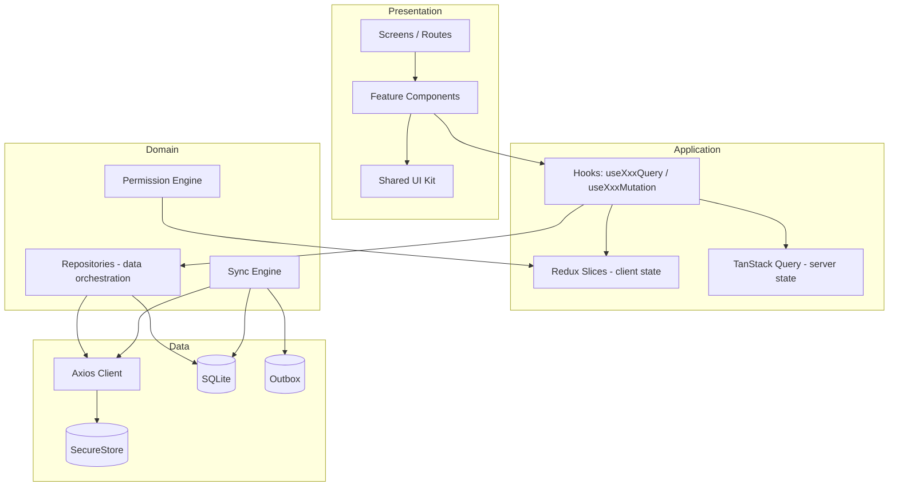
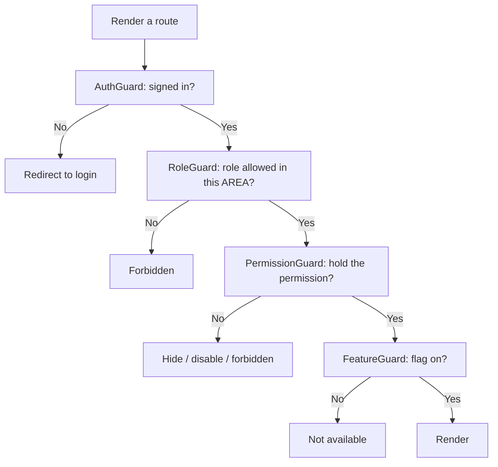
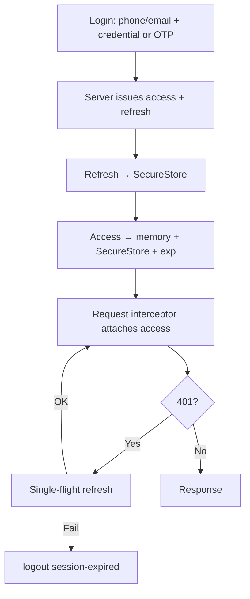
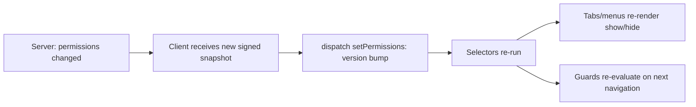
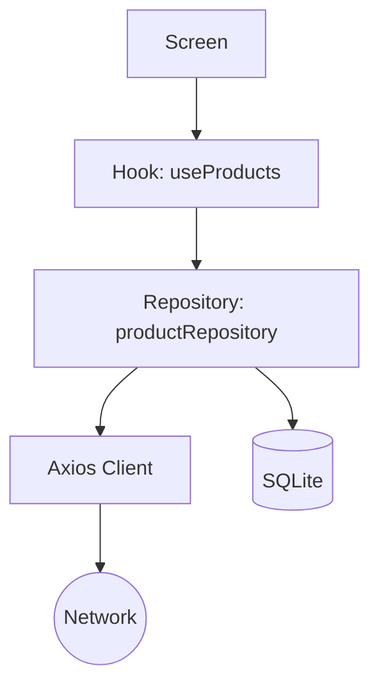
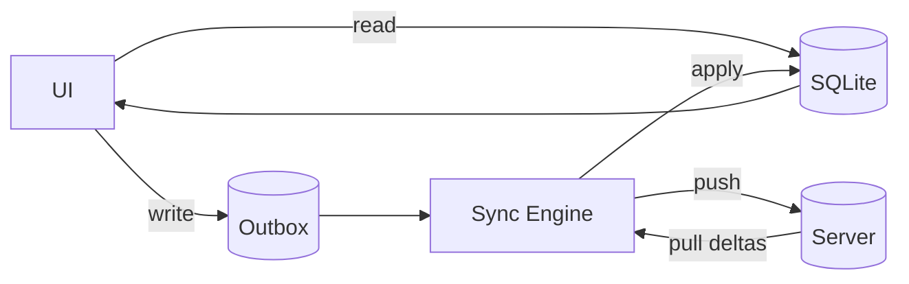
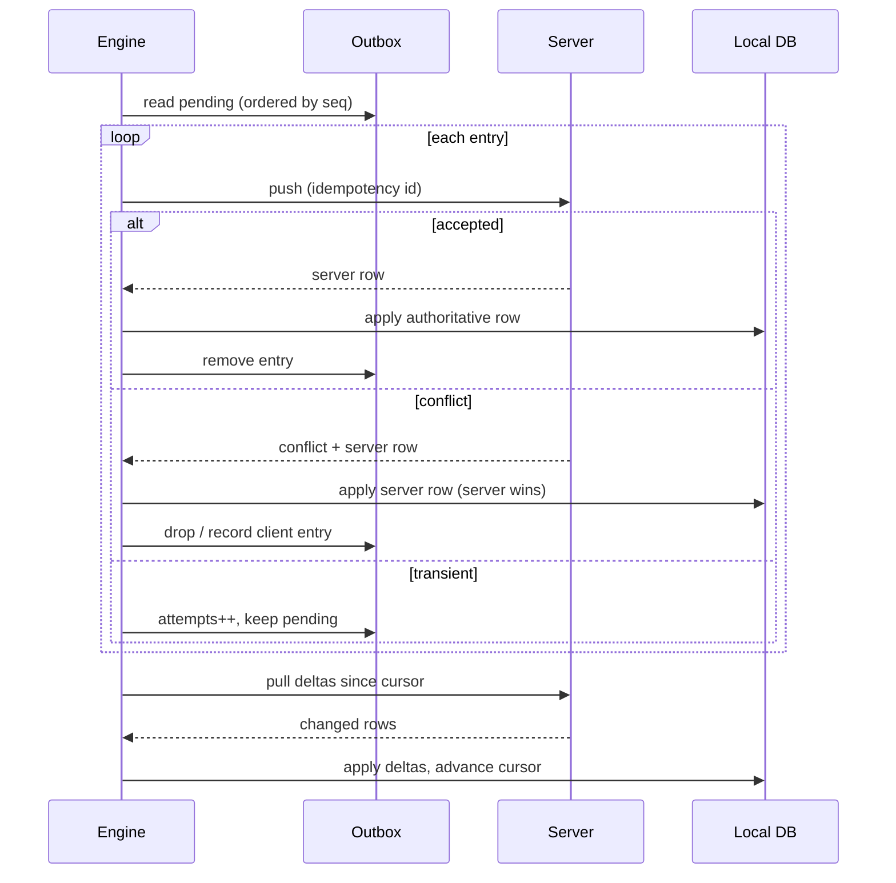

# React Native + Expo — Enterprise Architecture

> **Status:** Authoritative architecture reference.
> **Audience:** Senior engineers, tech leads, architects building or extending the app.
> **Scope:** A large-scale, multi-team, offline-first React Native (Expo) application. Modeled on a point-of-sale / retail domain but applicable to any production mobile system with authentication, role-based access, and offline requirements.

This document **decides**. Where the industry offers competing choices, it states the trade-off and commits to one. Consistency is itself an architectural property: a team cannot share a codebase on a menu of equally-valid options. Deviations are allowed but must be recorded in the decision log (§20) with a rationale.

Every code sample in this document is internally consistent with every other — the same error type, the same permission location, the same token model throughout. Copy-paste should compile.

---

## Table of contents

1. [The stack (locked)](#1-the-stack-locked)
2. [Architecture philosophy & layering](#2-architecture-philosophy--layering)
3. [Folder structure](#3-folder-structure)
4. [Import boundaries (enforced)](#4-import-boundaries-enforced)
5. [Navigation architecture](#5-navigation-architecture)
6. [Navigation flows](#6-navigation-flows)
7. [Protected routes & guards](#7-protected-routes--guards)
8. [Authentication architecture](#8-authentication-architecture)
9. [Role-based access control (RBAC)](#9-role-based-access-control-rbac)
10. [State management](#10-state-management)
11. [API layer architecture](#11-api-layer-architecture)
12. [Offline-first architecture](#12-offline-first-architecture)
13. [Security architecture](#13-security-architecture)
14. [Performance architecture](#14-performance-architecture)
15. [Error handling](#15-error-handling)
16. [Expo ecosystem, OTA & EAS](#16-expo-ecosystem-ota--eas)
17. [UI system](#17-ui-system)
18. [Testing strategy](#18-testing-strategy)
19. [Anti-patterns (banned)](#19-anti-patterns-banned)
20. [Governance, scaling & decision log](#20-governance-scaling--decision-log)

---

# 1. The stack (locked)

| Concern | Choice | Rationale |
|---|---|---|
| Framework | **Expo SDK** (managed workflow, New Architecture on) | EAS Build/Update, OTA, broad native coverage, one codebase for iOS/Android/web |
| Language | **TypeScript** `strict` + `noUncheckedIndexedAccess` | Compile-time guarantees are non-negotiable at multi-team scale |
| Routing | **Expo Router** (file-based) | Typed routes, automatic deep linking, one mental model, web parity |
| Server state | **TanStack Query v5** | Caching, dedup, background refetch, the right tool for remote data |
| Client state | **Redux Toolkit v2** (+ redux-persist for non-secret slices) | Explicit, debuggable, mature devtools; synchronous selectors fit guards |
| Local DB | **expo-sqlite** + a typed query layer in `core/db` | Relational offline cache; SQL is the right model for POS data |
| Secrets | **expo-secure-store** (Keychain / Keystore) | Hardware-backed token storage |
| Forms | **react-hook-form + Zod** | Uncontrolled performance + schema validation reused on the wire |
| Networking | **Single Axios client** + one interceptor chain | One auth-refresh path, one error-normalization boundary |
| Connectivity | **expo-network** + an HTTP reachability probe | Managed-workflow fit; OS signal + true API reachability |
| Persistence (warm start) | **redux-persist** (auth/prefs) + **react-query-persist-client** (server cache) | Instant warm start; both schema-versioned |
| Lists | **@shopify/flash-list** | Item recycling; the single biggest list-perf win |
| Monitoring | **Sentry** (`@sentry/react-native`) | Crash + performance + breadcrumbs |
| Testing | **Jest + RNTL + Maestro** | Unit/integration + black-box E2E |

> **State-management commitment (the decision teams fight over):** **Redux Toolkit for client state, TanStack Query for server state. Zustand is not used.** This is a consistency decision, not a quality judgement — Zustand is excellent for a single-team app. At multi-team scale the codebase standardizes on one client-state library, and Redux's middleware ecosystem, devtools, and ubiquity win the consistency argument. Mixing Zustand and Redux across teams is exactly the fragmentation this document exists to prevent.

---

# 2. Architecture philosophy & layering

The application is **feature-modular on the outside, layered on the inside**. Top-level code is organized by *business capability* (auth, catalog, sales, customers) — never by technical role (no global `components/`, `services/`, `hooks/` dumping grounds). Inside each feature, code is layered: UI → hooks → repository → data sources.

Three properties drive every other decision:

1. **A feature must be deletable.** If removing `features/sales/` breaks `features/catalog/`, the boundary is wrong. Features depend on `core/` and `ui/`, never on each other's internals.
2. **Offline-first means offline-*primary*.** The UI reads from the local DB and writes to a local outbox. The network is a sync target, not a runtime dependency. A user mid-transaction never blocks on a request.
3. **The server is the authority; the client is a cache with intent.** The client never makes a final authorization decision. It optimistically reflects intent and reconciles against the server, which re-validates everything.

### 2.1 The layered view



**Dependency rule (enforced, not aspirational):** dependencies point **downward only**. Presentation → Application → Domain → Data. Nothing calls upward. A repository never imports a screen; the API client never reads Redux. Enforced by lint (§4) and reviewed in PRs.

### 2.2 Separation of concerns

| Layer | May do | May NOT do |
|---|---|---|
| Screen / Route | Compose components, read hooks, trigger navigation | Call the API client, hold business rules, read SecureStore |
| Feature component | Render, call feature hooks | Know about other features, hold global state |
| Hook | Bridge components to Query/Redux/repositories | Contain SQL, hold long-lived state outside the store |
| Repository | Orchestrate API + DB + outbox for one resource | Render, navigate, touch React |
| API client | HTTP, interceptors, auth refresh, error normalization | Business rules, navigation |
| Sync engine | Reconcile local ↔ server | Render, decide authorization |

---

# 3. Folder structure

```text
.
├── app/                          # Expo Router routes ONLY (file = route)
│   ├── _layout.tsx               # Root: providers, session restore, splash
│   ├── (auth)/                   # Unauthenticated group
│   │   ├── _layout.tsx
│   │   ├── welcome.tsx
│   │   ├── login.tsx
│   │   └── otp.tsx
│   ├── (app)/                    # Authenticated group
│   │   ├── _layout.tsx           # The single auth gate
│   │   ├── (tabs)/
│   │   │   ├── _layout.tsx
│   │   │   ├── index.tsx          # Dashboard
│   │   │   ├── sales.tsx
│   │   │   └── more.tsx
│   │   ├── admin/                 # Admin AREA (RoleGuard)
│   │   │   └── _layout.tsx
│   │   ├── manage/                # Manager AREA (RoleGuard)
│   │   │   └── _layout.tsx
│   │   ├── product/[id].tsx
│   │   └── settings/
│   ├── +not-found.tsx
│   └── +native-intent.ts         # Deep-link sanitization
│
├── src/
│   ├── features/                 # Business capabilities (team-owned)
│   │   ├── auth/
│   │   │   ├── components/        # Feature-private UI
│   │   │   ├── hooks/             # useLogin, useOtpVerify
│   │   │   ├── repository/        # auth orchestration
│   │   │   ├── model/             # types + Zod schemas
│   │   │   └── index.ts           # PUBLIC surface (only import target)
│   │   ├── catalog/
│   │   ├── sales/
│   │   ├── customers/
│   │   └── settings/
│   │
│   ├── core/                     # Shared infrastructure (changes rarely)
│   │   ├── network/              # Axios client, interceptors, error model, refresh
│   │   ├── db/                   # SQLite singleton, migrations, typed queries
│   │   ├── sync/                 # Sync engine, outbox, appliers, triggers
│   │   ├── auth/                 # Token manager, session, biometric, logout
│   │   ├── permissions/          # Permission engine, guards, hooks, verify
│   │   ├── store/                # Redux store, root reducer, typed hooks, slices
│   │   ├── events/               # Typed cross-feature event bus (sparingly)
│   │   ├── providers/            # App-wide providers (composed in root)
│   │   └── config/               # Env, constants, feature flags
│   │
│   ├── ui/                       # Design system (zero business logic)
│   │   ├── components/
│   │   ├── theme/                # Tokens, colors, spacing, typography
│   │   └── primitives/           # Row, Column, Spacer, etc.
│   │
│   ├── localization/             # i18n setup, locale files
│   ├── utils/                    # Pure, dependency-free helpers
│   └── types/                    # Cross-cutting wire contracts
│
├── __tests__/
├── e2e/                          # Maestro flows
├── app.config.ts
├── eas.json
└── tsconfig.json
```

### 3.1 Why `app/` and `src/features/` are separate

`app/` contains **routes**; `src/features/` contains **implementation**. A route file is a thin binding that imports a screen from a feature and renders it.

```tsx
// app/(app)/product/[id].tsx — a ROUTE, not a screen
import { useLocalSearchParams } from 'expo-router';
import { ProductDetailScreen } from '@features/catalog';

export default function ProductDetailRoute() {
  const { id } = useLocalSearchParams<{ id: string }>();
  return <ProductDetailScreen productId={id} />;
}
```

Routing (a structural concern) stays separate from feature implementation (a team concern). Moving a screen never breaks a deep link as long as the route file stays.

### 3.2 Don't create empty folders for symmetry

`catalog` and `sales` need `repository/`; `auth` barely needs persistence; not every feature needs a `model/sync/`. Add a folder when there's something to put in it. Empty folders for symmetry add noise and signal nothing.

---

# 4. Import boundaries (enforced)

Enforced with `eslint-plugin-boundaries` (or `no-restricted-imports` on path aliases if you want zero new deps).

```jsonc
// .eslintrc — boundaries (illustrative)
{
  "rules": {
    "boundaries/element-types": ["error", {
      "default": "disallow",
      "rules": [
        { "from": "app",      "allow": ["features", "core", "ui"] },
        { "from": "features", "allow": ["core", "ui", "utils", "types"] },
        { "from": "core",     "allow": ["core", "utils", "types", "config"] },
        { "from": "ui",       "allow": ["ui", "utils"] },
        { "from": "utils",    "allow": ["utils", "types"] }
      ]
    }]
  }
}
```

**Hard rules:**

1. A feature may not import another feature's internals. Only `@features/catalog` (its `index.ts`) is importable — **including from lazy `import()`**. `import('@features/reports/components/HeavyChart')` is a violation; export the widget from the feature's public surface first.
2. `core/` may not import `features/`. Infrastructure doesn't know business capabilities exist.
3. `ui/` may not import `features/` or `core/`. The design system is pure presentation.
4. `utils/` imports only utils and types. Tree-shakeable, trivially testable.

**Cross-feature communication** (when `sales` must react to something in `auth`):
- Read a shared concept from `core/` (e.g. the session lives in `core/auth`, not in the auth feature).
- Consume a feature's published `index.ts` contract.
- For decoupled reactions, the typed event bus in `core/events` (kept small and documented).
- For server-cache freshness, `queryClient.invalidateQueries(...)`.

Pick **one** mechanism per concern and document it; do not use all four for the same thing.

```jsonc
// tsconfig.json
{ "compilerOptions": { "paths": {
  "@features/*": ["src/features/*"],
  "@core/*":     ["src/core/*"],
  "@ui/*":       ["src/ui/*"],
  "@utils/*":    ["src/utils/*"],
  "@types/*":    ["src/types/*"]
}}}
```

> Aliases must match between `tsconfig.json` and `babel.config.js` (module-resolver) or you get IDE-passes-build-fails. CI must check this.

---

# 5. Navigation architecture

**Decision: Expo Router.** Built on React Navigation, it adds file-based routing, typed routes, and automatic deep linking. For a multi-team app the decisive factors are: file-based routes make the navigation surface legible without reading navigator wiring; file-derived deep linking eliminates "the link works only if X is mounted" bugs; typed routes catch broken navigation at compile time; one model spans native and web. The cost — slightly less imperative control — is rarely binding, and you can drop to React Navigation primitives inside a layout when needed.

### 5.1 Mental model: layouts are navigators

- **The file system is the route tree.** `app/(app)/(tabs)/sales.tsx` is `/sales`.
- **`_layout.tsx` files are navigators.** A `_layout` rendering `<Stack>` is a stack; `<Tabs>` is a tab navigator. The layout also hosts guards and providers for everything beneath it.
- **Route groups `(name)` organize without URL segments.** `(auth)` / `(app)` partition the tree without appearing in the path.

### 5.2 Root layout

```tsx
// app/_layout.tsx
import { useEffect } from 'react';
import { Stack, SplashScreen } from 'expo-router';
import { Provider as ReduxProvider } from 'react-redux';
import { QueryClientProvider } from '@tanstack/react-query';
import { store } from '@core/store';
import { queryClient } from '@core/network/query-client';
import { AppProviders } from '@core/providers';
import { useSessionRestore } from '@core/auth';

SplashScreen.preventAutoHideAsync();

export default function RootLayout() {
  return (
    <ReduxProvider store={store}>
      <QueryClientProvider client={queryClient}>
        <AppProviders>
          <RootNavigator />
        </AppProviders>
      </QueryClientProvider>
    </ReduxProvider>
  );
}

function RootNavigator() {
  const { status } = useSessionRestore(); // reads SecureStore, validates/refreshes

  useEffect(() => {
    if (status !== 'restoring') SplashScreen.hideAsync();
  }, [status]);

  if (status === 'restoring') return null; // splash stays; no flash of wrong screen

  // Both groups always declared so deep links remain resolvable; the guards
  // inside each group decide reachability (§7).
  return (
    <Stack screenOptions={{ headerShown: false }}>
      <Stack.Screen name="(auth)" />
      <Stack.Screen name="(app)" />
      <Stack.Screen name="+not-found" />
    </Stack>
  );
}
```

### 5.3 Group layouts

```tsx
// app/(auth)/_layout.tsx
import { Redirect, Stack } from 'expo-router';
import { useAppSelector } from '@core/store';

export default function AuthLayout() {
  const isAuthed = useAppSelector((s) => s.auth.status === 'authenticated');
  if (isAuthed) return <Redirect href="/(app)/(tabs)" />; // bounce stale deep links
  return <Stack screenOptions={{ headerShown: false }} />;
}
```

```tsx
// app/(app)/_layout.tsx — the single auth gate for the whole authenticated tree
import { Redirect, Stack } from 'expo-router';
import { useAppSelector } from '@core/store';

export default function AppLayout() {
  const status = useAppSelector((s) => s.auth.status);
  if (status !== 'authenticated') return <Redirect href="/(auth)/welcome" />;

  return (
    <Stack screenOptions={{ headerShown: false }}>
      <Stack.Screen name="(tabs)" />
      <Stack.Screen name="product/[id]" options={{ presentation: 'card' }} />
      <Stack.Screen name="settings" />
    </Stack>
  );
}
```

### 5.4 Deep linking

Expo Router derives the deep-link map from the file tree — no manual `linking` config. `app/(app)/product/[id].tsx` is reachable at `myapp://product/42` and `https://myapp.com/product/42`.

```ts
// app.config.ts (excerpt)
export default {
  scheme: 'myapp',
  ios: { associatedDomains: ['applinks:myapp.com'] },
  android: {
    intentFilters: [{
      action: 'VIEW', autoVerify: true,
      data: [{ scheme: 'https', host: 'myapp.com' }],
      category: ['BROWSABLE', 'DEFAULT'],
    }],
  },
};
```

> `apple-app-site-association` (iOS) and `assetlinks.json` (Android) must be served as `application/json` with no redirects and are heavily cached (expect up to 24h propagation). Test with `curl` and on real devices, not simulators. Deep links must arrive at the **same routes** in-app navigation uses — divergent paths are two bugs to maintain.

Deep-link **security** is handled by the same group guards (§7, §13.4): a link to `/(app)/product/42` passes through `app/(app)/_layout.tsx`, which redirects to login if unauthenticated, then restores the destination post-login.

### 5.5 Navigation inside pages

```tsx
import { router, Link } from 'expo-router';

router.push('/product/42');      // forward; back returns here
router.replace('/(app)/(tabs)'); // swap current entry (login → app, splash → home)
router.back();                   // pop one
router.dismissAll();             // close a presented flow
<Link href="/product/42">View</Link>; // declarative, preferred for static links
```

| Call | Use when |
|---|---|
| `push` | Forward nav the user can back out of (list → detail) |
| `replace` | Current screen must not be returned to (login → app) |
| `dismissAll` + `replace` | Resetting a flow (after checkout) |
| `<Redirect>` | Conditional redirect during render (guards) |

Centralize route strings so a rename is one edit:

```ts
// core/navigation/routes.ts
export const Routes = {
  dashboard: '/(app)/(tabs)',
  product: (id: string) => `/product/${id}`,
  login: '/(auth)/welcome',
} as const;
```

> **Never navigate from a repository, service, or thunk.** Navigation is a presentation concern; return a result and let the screen navigate (§19).

---

# 6. Navigation flows

### 6.1 Cold-start flow

```mermaid
flowchart TD
    A[App Start] --> B[Splash visible]
    B --> C[Session Restore: read SecureStore]
    C --> D{Refresh token present?}
    D -->|No| E[(auth) → Welcome]
    D -->|Yes| F{Access token valid by exp?}
    F -->|Expired| G[Silent refresh]
    G -->|OK| H[Hydrate auth + permissions]
    G -->|Fail| E
    F -->|Valid| H
    H --> K[(app) → Dashboard]
    E --> L[Hide splash]
    K --> L
```

### 6.2 Session restore

Single most important flow — runs on every cold start, determines the first screen. Lives in `core/auth`, consumed once in the root layout.

```ts
// core/auth/useSessionRestore.ts
import { useEffect, useState } from 'react';
import { useAppDispatch } from '@core/store';
import { tokenManager } from './token-manager';
import { setAuthenticated, setUnauthenticated } from '@core/store/auth-slice';
import { fetchAndStorePermissions } from '@core/permissions';

type RestoreStatus = 'restoring' | 'authenticated' | 'unauthenticated';

export function useSessionRestore(): { status: RestoreStatus } {
  const dispatch = useAppDispatch();
  const [status, setStatus] = useState<RestoreStatus>('restoring');

  useEffect(() => {
    let cancelled = false;
    (async () => {
      // restore() validates exp and silently refreshes an expired access token
      // when the refresh token is still valid. null = no usable session.
      const session = await tokenManager.restore();
      if (cancelled) return;

      if (!session) {
        dispatch(setUnauthenticated());
        setStatus('unauthenticated');
        return;
      }
      dispatch(setAuthenticated(session));
      await fetchAndStorePermissions(); // verify + store signed snapshot (§9)
      if (cancelled) return;
      setStatus('authenticated');
    })();
    return () => { cancelled = true; };
  }, [dispatch]);

  return { status };
}
```

**Auto-login** = a valid refresh token in SecureStore → silent refresh → authenticated, no user interaction. Possession of a valid refresh token *is* the persisted session; there is no separate "remember me" flag.

### 6.3 Logout flow

Complete and ordered: credentials first (so a crash mid-logout can't leave a usable token), then local data, then caches, then navigate.

```ts
// core/auth/logout.ts
import { router } from 'expo-router';
import { store, resetStore } from '@core/store';
import { queryClient } from '@core/network/query-client';
import { tokenManager } from './token-manager';
import { flushOutboxIfOnline, clearLocalData } from '@core/sync';

export async function logout(reason: 'user' | 'session-expired' = 'user') {
  // Preserve unsynced work: attempt a final flush while still authenticated-ish.
  // On session-expired we can't push (token is dead) — keep the outbox and
  // replay after re-auth instead of destroying it. See §12.7.
  if (reason === 'user') await flushOutboxIfOnline();

  await tokenManager.clear();
  clearLocalData({ preserveOutbox: reason === 'session-expired' });
  queryClient.clear();
  store.dispatch(resetStore());
  router.replace('/(auth)/welcome');
}
```

### 6.4 Session expiration

Detected in two places, both routed to `logout('session-expired')`:
1. **Proactively** during a request: the response interceptor sees a `401`, attempts a single-flight refresh once, and on failure triggers expiry logout (§8.3).
2. **On resume**: when the app foregrounds, validity is re-checked; an expired-and-unrefreshable session logs out.

The user sees one clear message ("Your session expired — please sign in again"), not a cascade of failed-request errors.

---

# 7. Protected routes & guards

Protection is layered. **Coarse, structural checks belong in layouts (route-level); fine, capability checks belong in components (control-level).**



| Guard | Question | Where | Failure |
|---|---|---|---|
| **AuthGuard** | Signed in? | `app/(app)/_layout.tsx` (one gate) | Redirect to `(auth)` |
| **RoleGuard** | Right role for this *area*? | Sub-area `_layout` | Forbidden screen |
| **PermissionGuard** | Hold this permission? | Screen entry + controls | Hide / disable / forbidden |
| **FeatureGuard** | Flag on for this user/tenant? | Screen or sub-area | "Not available" |

### 7.1 RoleGuard (area-level)

```tsx
// core/permissions/RoleGuard.tsx
import { Redirect } from 'expo-router';
import { useAppSelector } from '@core/store';
import { selectActiveRole } from '@core/permissions/selectors';
import type { Role } from './types';
import { ForbiddenScreen } from '@ui/components';

export function RoleGuard({ allow, children }: { allow: Role[]; children: React.ReactElement }) {
  const role = useAppSelector(selectActiveRole);
  if (!role) return <Redirect href="/(auth)/welcome" />;
  if (!allow.includes(role)) return <ForbiddenScreen />;
  return children;
}
```

```tsx
// app/(app)/admin/_layout.tsx
import { Stack } from 'expo-router';
import { RoleGuard } from '@core/permissions';

export default function AdminLayout() {
  return (
    <RoleGuard allow={['super_admin', 'owner']}>
      <Stack screenOptions={{ headerShown: false }} />
    </RoleGuard>
  );
}
```

### 7.2 PermissionGate (control-level — the workhorse)

```tsx
// core/permissions/PermissionGate.tsx
import { useHasPermission } from './useHasPermission';
import type { Permission } from './types';

export function PermissionGate({
  permission, fallback = null, children,
}: { permission: Permission; fallback?: React.ReactNode; children: React.ReactNode }) {
  return useHasPermission(permission) ? <>{children}</> : <>{fallback}</>;
}
```

```tsx
<PermissionGate permission="inventory.create">
  <Button label="Add product" onPress={openCreate} />
</PermissionGate>

function ReportsScreen() {
  if (!useHasPermission('reports.read')) return <ForbiddenScreen />;
  return <Reports />;
}
```

### 7.3 The critical rule

> **A client guard is UX, not security.** Hiding a button does not protect the operation — **the server re-validates every mutation** (§8, §9). The client guard prevents a user from seeing controls they can't use; it does not enforce authorization. Never ship a client where the only check is client-side.

---

# 8. Authentication architecture



### 8.1 Token storage

| Token | Lifetime | Stored | Why |
|---|---|---|---|
| Access | Short (~15 min) | In-memory + SecureStore + decoded `exp` | Limits blast radius; SecureStore copy survives backgrounding |
| Refresh | Long (~30 days) | **SecureStore only** | Hardware-backed; never JS-readable storage |

**Never** store tokens in AsyncStorage, redux-persist, or any plain-file storage — those are readable on a compromised device and may be cloud-backed up.

### 8.2 Token manager (correct: checks expiry, real biometric gate)

```ts
// core/auth/token-manager.ts
import * as SecureStore from 'expo-secure-store';
import { decodeJwtExp } from './jwt';            // returns epoch seconds or null
import { refreshAccessToken } from '@core/network/refresh';

const ACCESS = 'auth.access';
const REFRESH = 'auth.refresh';
const EXPIRY_SKEW_SEC = 30; // refresh slightly early to avoid edge-of-expiry 401s

let accessMemory: string | null = null; // hot path: avoid a SecureStore read per request

interface Session { access: string; refresh: string }

export const tokenManager = {
  async persist(access: string, refresh: string, biometric = false) {
    accessMemory = access;
    const opts: SecureStore.SecureStoreOptions = {
      keychainAccessible: SecureStore.WHEN_UNLOCKED_THIS_DEVICE_ONLY,
      // requireAuthentication must be set AT WRITE TIME to bind the item to
      // biometric. Reading later with requireAuthentication does nothing if it
      // was written without it.
      requireAuthentication: biometric,
    };
    await SecureStore.setItemAsync(ACCESS, access, opts);
    await SecureStore.setItemAsync(REFRESH, refresh, opts);
  },

  getAccess(): string | null {
    return accessMemory;
  },

  async restore(): Promise<Session | null> {
    const refresh = await SecureStore.getItemAsync(REFRESH);
    if (!refresh) return null;

    const access = await SecureStore.getItemAsync(ACCESS);
    accessMemory = access;

    const exp = access ? decodeJwtExp(access) : null;
    const now = Math.floor(Date.now() / 1000);
    const valid = !!access && exp != null && exp - EXPIRY_SKEW_SEC > now;

    if (valid) return { access: access!, refresh };

    // Expired or missing access → refresh. null means the refresh failed.
    const newAccess = await refreshAccessToken();
    return newAccess ? { access: newAccess, refresh: await SecureStore.getItemAsync(REFRESH) ?? refresh } : null;
  },

  async clear() {
    accessMemory = null;
    await SecureStore.deleteItemAsync(ACCESS);
    await SecureStore.deleteItemAsync(REFRESH);
  },
};
```

### 8.3 Refresh — single-flight with rotation

If ten requests 401 at once they must share **one** refresh call, or the refresh token rotates ten times and nine requests carry a dead token.

```ts
// core/network/refresh.ts
import { tokenManager } from '@core/auth/token-manager';
import { postRefresh, getStoredRefreshToken } from './refresh-transport'; // uses a BARE axios instance, not `api`

let inFlight: Promise<string | null> | null = null;

export function refreshAccessToken(): Promise<string | null> {
  if (inFlight) return inFlight; // coalesce concurrent callers

  inFlight = (async () => {
    try {
      const refresh = await getStoredRefreshToken();
      if (!refresh) return null;
      const { access, refresh: rotated } = await postRefresh(refresh);
      await tokenManager.persist(access, rotated); // rotation: store the new refresh too
      return access;
    } catch {
      return null;
    } finally {
      inFlight = null;
    }
  })();

  return inFlight;
}
```

> **`postRefresh` must use a bare Axios instance**, not the app `api` instance — otherwise a 401 from the refresh endpoint itself re-enters the response interceptor and can recurse.

```ts
// core/network/interceptors.ts — response interceptor
import { refreshAccessToken } from './refresh';
import { logout } from '@core/auth/logout';

export function attachRefreshInterceptor(api) {
  api.interceptors.response.use(
    (r) => r,
    async (error) => {
      const original = error.config;
      if (error.response?.status === 401 && !original._retried) {
        original._retried = true;
        const access = await refreshAccessToken();
        if (access) {
          original.headers.Authorization = `Bearer ${access}`;
          return api(original); // replay once
        }
        await logout('session-expired');
      }
      return Promise.reject(error);
    },
  );
}
```

### 8.4 Biometric authentication

Biometrics gate **access to a stored session**; they do not replace it. Persist the refresh token with `requireAuthentication: true` (§8.2) so the OS prompts on read.

```ts
// core/auth/biometric.ts
import * as LocalAuthentication from 'expo-local-authentication';

export async function unlockSession(): Promise<boolean> {
  const ok = (await LocalAuthentication.hasHardwareAsync())
    && (await LocalAuthentication.isEnrolledAsync());
  if (!ok) return true; // no hardware/enrolment → fall through to normal flow, don't hard-block

  const res = await LocalAuthentication.authenticateAsync({
    promptMessage: 'Unlock',
    disableDeviceFallback: false, // biometric fails often (wet hands, masks); allow PIN fallback
  });
  return res.success;
}
```

> A passing biometric never grants a permission the server wouldn't. The server still issues and validates tokens.

### 8.5 Session management & multi-device

- **One session = one device.** The refresh token is bound to a device id registered at login; the server can revoke a single device.
- **Foreground re-validation.** On `AppState → active`, if the access token is near expiry, refresh proactively.
- **Refresh-token reuse detection (server requirement).** With rotation, the server must detect reuse of a rotated (stolen) token and revoke the lineage. State this in the API contract.
- Push tokens register per device so notifications target the right one.

### 8.6 Checklist

- ✅ Refresh in SecureStore only; never AsyncStorage/redux-persist.
- ✅ Access token expiry decoded and checked on restore.
- ✅ Single-flight refresh with rotation; refresh transport uses a bare client.
- ✅ Biometric items written with `requireAuthentication: true`.
- ✅ Complete, ordered logout; unsynced outbox preserved on session-expiry.
- ✅ Server re-validates everything; the client token is a claim, not a grant.
- ✅ Per-device session lineage + reuse detection.
- ✅ No secrets in the JS bundle or source.

---

# 9. Role-based access control (RBAC)

### 9.1 The central decision

> **Authorize on permissions, never on role names.** A role is a server-defined bundle of permissions, used only for coarse area-gating (§7.1) and display. The UI and guards check `inventory.create`, never `role === 'manager'`.

Why this scales: hardcoded role checks rot (a new "Senior Cashier" role means editing dozens of files); permission checks make a new role a server-side grant with zero client change; custom enterprise roles work without a client release; the server is the single source of truth.

### 9.2 Types (one definition, used everywhere)

```ts
// core/permissions/types.ts
export type Role = 'super_admin' | 'owner' | 'manager' | 'cashier' | 'staff';

export type Permission =
  | 'inventory.read' | 'inventory.create' | 'inventory.update' | 'inventory.delete'
  | 'sales.read'     | 'sales.create'     | 'sales.void'
  | 'customer.read'  | 'customer.create'  | 'customer.update'
  | 'employee.read'  | 'employee.create'  | 'employee.update' | 'employee.delete'
  | 'reports.read'
  | 'settings.read'  | 'settings.update';

// Wire shape (signed by the server). Stored as an ARRAY for serializability.
export interface PermissionSnapshot {
  version: number;
  role: Role;
  permissions: Permission[];
}
```

> **Convention:** resource singular (`inventory.read`); action from a fixed set (`read|create|update|delete`) plus domain verbs (`sales.void`). No wildcards on the client — the server expands `inventory.*` before sending, so client checks are exact-match.

### 9.3 Where permissions come from

On login (and refresh, and piggybacked on sync when stale), the server returns a **signed** snapshot. The client verifies the signature, stores it, and checks against it. It never resolves roles → permissions itself.

```ts
// core/permissions/index.ts
import { store } from '@core/store';
import { setPermissions } from '@core/store/permissions-slice';
import { fetchSnapshot, verifySignature, parseSnapshot } from './transport';

export async function fetchAndStorePermissions() {
  const signed = await fetchSnapshot(store.getState().permissions.version);
  if (!signed) return; // server says "not stale", keep current
  const ok = await verifySignature(signed.payload, signed.signature);
  if (!ok) {
    store.dispatch(setPermissions({ version: 0, role: null, permissions: [] })); // tampered → no permissions
    return;
  }
  store.dispatch(setPermissions(parseSnapshot(signed.payload)));
}
```

> **Signature verification is defense-in-depth, not the security boundary** — the server re-validates every mutation. If on-device Ed25519 verification isn't yet wired (e.g. Expo Go has no Node `crypto.verify`), roll it out as **verify-but-warn** before enforcing, to avoid rejecting valid snapshots on a serialization mismatch. Until then, the server guarantee is what must be tested.

### 9.4 Storage & selectors (no `Set` in the store)

Store an **array** (serializable, persist-safe) and build the `Set` in a memoized selector — this removes the redux-persist landmine where a stored `Set` rehydrates empty.

```ts
// core/store/permissions-slice.ts
import { createSlice, PayloadAction } from '@reduxjs/toolkit';
import type { Permission, Role } from '@core/permissions/types';

interface PermissionsState { version: number; role: Role | null; permissions: Permission[] }
const initialState: PermissionsState = { version: 0, role: null, permissions: [] };

const slice = createSlice({
  name: 'permissions',
  initialState,
  reducers: {
    setPermissions(s, a: PayloadAction<{ version: number; role: Role | null; permissions: Permission[] }>) {
      s.version = a.payload.version; s.role = a.payload.role; s.permissions = a.payload.permissions;
    },
    clearPermissions: () => initialState,
  },
});
export const { setPermissions, clearPermissions } = slice.actions;
export default slice.reducer;
```

```ts
// core/permissions/selectors.ts
import { createSelector } from '@reduxjs/toolkit';
import type { RootState } from '@core/store';

const selectList = (s: RootState) => s.permissions.permissions;
export const selectActiveRole = (s: RootState) => s.permissions.role;
export const selectPermissionSet = createSelector([selectList], (list) => new Set(list)); // memoized: O(1) reads
```

```ts
// core/permissions/useHasPermission.ts
import { useAppSelector } from '@core/store';
import { selectPermissionSet } from './selectors';
import type { Permission } from './types';

export function useHasPermission(p: Permission): boolean {
  return useAppSelector((s) => selectPermissionSet(s).has(p));
}
export function useHasAny(...ps: Permission[]): boolean {
  return useAppSelector((s) => { const set = selectPermissionSet(s); return ps.some((p) => set.has(p)); });
}
export function useHasAll(...ps: Permission[]): boolean {
  return useAppSelector((s) => { const set = selectPermissionSet(s); return ps.every((p) => set.has(p)); });
}
```

### 9.5 Frontend vs backend

| | Frontend | Backend |
|---|---|---|
| Purpose | UX: show/hide/disable, gate screens | Security: enforce the operation |
| Source | Signed snapshot in Redux | Live DB resolution at request time |
| Trust | Untrusted (cosmetic) | Authoritative |

Both required. Client-only = a vulnerability; server-only = a bad experience.

### 9.6 Areas map to role-gated route groups

The template's "three role stacks" become **areas with guarded entry** — not role-swapped navigator trees (the anti-pattern in §19). All areas exist at all times; guards decide reachability. Tabs/menus render by permission so users never see a tab into an area they can't enter:

```tsx
// app/(app)/(tabs)/_layout.tsx
import { Tabs } from 'expo-router';
import { useHasAny } from '@core/permissions';

export default function TabsLayout() {
  const showManage = useHasAny('employee.read', 'inventory.read');
  const showAdmin = useHasAny('settings.update', 'reports.read');

  return (
    <Tabs screenOptions={{ headerShown: false }}>
      <Tabs.Screen name="index" options={{ title: 'Dashboard' }} />
      <Tabs.Screen name="sales" options={{ title: 'Sales' }} />
      {/* Stub routes (tabs)/manage.tsx and (tabs)/admin.tsx redirect into the
          area; href:null removes the tab when not permitted. */}
      <Tabs.Screen name="manage" options={{ title: 'Manage', href: showManage ? '/manage' : null }} />
      <Tabs.Screen name="admin"  options={{ title: 'Admin',  href: showAdmin ? '/admin' : null }} />
    </Tabs>
  );
}
```

> A tab's `name` must correspond to a real route node inside the tabs layout. If the destination area lives outside `(tabs)`, add a thin stub route (`(tabs)/manage.tsx`) that `<Redirect>`s into the area, so the tab has something to attach to.

### 9.7 Runtime permission change — no remount



Because visibility and guards read from the slice via selectors, a single `dispatch(setPermissions(...))` updates the whole UI surface reactively. No navigator remount, no state loss.

---

# 10. State management

### 10.1 The split

| State | Home | Why |
|---|---|---|
| Auth status, active role, device id | Redux `auth` slice | Client-authoritative session; drives guards. Tokens live in SecureStore, not here |
| Permission snapshot | Redux `permissions` slice (array + selector) | Client cache of a signed grant; read synchronously by guards |
| User profile | TanStack Query `['me']` | Server source of truth; refetchable |
| Products / sales / customers | TanStack Query | Server data; cached, paginated, synced |
| UI prefs (theme, language) | Redux `prefs` (persisted) | Client-owned, survives restart |
| Outbox + sync status | Redux `sync` slice | Client operational state |
| Ephemeral form state | react-hook-form (local) | Never global |
| Navigation state | Expo Router (owns it) | Never mirrored into Redux |

### 10.2 Rules

- One slice per client-state concern; never a god-slice.
- Deriving selectors use `createSelector`; raw selectors return stable references.
- Thunks orchestrate (login → persist tokens → fetch permissions → hydrate); they never render or navigate.
- **Server data is never copied into Redux** "to have it handy" — that's a second, stale source. Read it from Query.
- `redux-persist` whitelists only `auth` (non-secret fields) and `prefs`. Permissions are re-fetched and re-verified on launch; persistence is a cold-start convenience, not the authoritative copy.
- Persist the Query cache to MMKV via `react-query-persist-client`, **schema-versioned** — bump the version on shape changes or you deserialize incompatible data.

### 10.3 Query client defaults (mobile-tuned)

```ts
// core/network/query-client.ts
import { QueryClient } from '@tanstack/react-query';
import { isAuthError } from './errors';

export const queryClient = new QueryClient({
  defaultOptions: {
    queries: {
      staleTime: 30_000,            // prevent refetch storms
      gcTime: 5 * 60_000,           // keep data when screens blur
      retry: (count, err) => (isAuthError(err) ? false : count < 3),
      refetchOnWindowFocus: false,  // mobile has no "window focus"
      refetchOnReconnect: true,
    },
    mutations: { retry: 0 },        // mutations go through the sync queue, not auto-retry
  },
});
```

---

# 11. API layer architecture

### 11.1 The layers



| Layer | Responsibility | Never |
|---|---|---|
| Client | HTTP, interceptors, auth refresh, error → typed-error | Business rules, navigation, React |
| Repository | Choose local DB vs network; map rows ↔ domain | UI, React hooks |
| Hook | Wrap repo calls in TanStack Query | SQL, raw fetch |
| Screen | Render, call hooks, navigate | Everything below the hook |

### 11.2 Axios client

```ts
// core/network/client.ts
import axios from 'axios';
import { tokenManager } from '@core/auth/token-manager';
import { attachRefreshInterceptor } from './interceptors';
import { toApiError } from './errors';

export const api = axios.create({
  baseURL: process.env.EXPO_PUBLIC_API_URL,
  timeout: 15_000,
});

api.interceptors.request.use((config) => {
  // Public endpoints opt out of auth via a flag, NOT by deleting the header
  // downstream (a downstream delete is undone here — see §11.4).
  if ((config as any).skipAuth) return config;
  const token = tokenManager.getAccess();
  if (token) config.headers.Authorization = `Bearer ${token}`;
  return config;
});

attachRefreshInterceptor(api); // single-flight 401 → refresh → retry (§8.3)

api.interceptors.response.use((r) => r, (error) => Promise.reject(toApiError(error)));
```

### 11.3 The typed request builder (`APIData`) — corrected

This is the `APIData` class, with the four bugs fixed: boundary-safe path resolution, a real `skipAuth` flag, multipart `request` wired up, and DELETE using the computed body. It emits the unified `ApiError` (§15), so `kind`-based handling works.

```ts
// core/network/api-data.ts
import { AxiosRequestConfig, AxiosResponse } from 'axios';
import type { UseQueryOptions, UseMutationOptions, QueryKey } from '@tanstack/react-query';
import { api } from './client';
import { toApiError, ApiError } from './errors';

export enum APIMethod { POST='post', GET='get', PUT='put', PATCH='patch', DELETE='delete' }
type PathRecord = Record<string, string | number | undefined>;
const escapeRe = (s: string) => s.replace(/[.*+?^${}()|[\]\\]/g, '\\$&');

export interface RequestParams<T> { bodyParam?: T; queryParam?: string; pathParam?: PathRecord }
export interface RequestParamsMultiPart<T> { request?: T; file: Blob; queryParam?: string; pathParam?: PathRecord }

export class APIData {
  constructor(
    public path: string,
    public method: APIMethod,
    private opts?: { public?: boolean },
  ) {}

  private generatePath(data?: PathRecord, queryParam?: string): string {
    let result = this.path;
    if (data) {
      for (const [key, value] of Object.entries(data)) {
        if (value == null) continue;
        // Boundary-aware: ":org" must NOT match inside ":orgId".
        const boundary = `:${escapeRe(key)}(?![A-Za-z0-9_])`;
        if (!new RegExp(boundary).test(result)) {
          throw new Error(`APIData: path "${this.path}" has no ":${key}" placeholder`);
        }
        result = result.replace(new RegExp(boundary, 'g'), encodeURIComponent(String(value)));
      }
    }
    const unresolved = result.match(/:[A-Za-z_][A-Za-z0-9_]*/g);
    if (unresolved) throw new Error(`APIData: unresolved placeholders in "${this.path}": ${unresolved.join(', ')}`);
    return queryParam ? `${result}${queryParam}` : result;
  }

  private async route<T>(param?: RequestParams<T>, formData?: FormData, config?: AxiosRequestConfig): Promise<AxiosResponse> {
    const path = this.generatePath(param?.pathParam, param?.queryParam);
    const cfg = { ...config, skipAuth: this.opts?.public } as AxiosRequestConfig & { skipAuth?: boolean };
    const body = formData ?? param?.bodyParam;
    switch (this.method) {
      case APIMethod.POST:   return api.post(path, body, cfg);
      case APIMethod.GET:    return api.get(path, cfg);
      case APIMethod.PUT:    return api.put(path, body, cfg);
      case APIMethod.PATCH:  return api.patch(path, body, cfg);
      case APIMethod.DELETE: return api.delete(path, { ...cfg, data: body });
    }
  }

  queryOptions<TRes>(params?: RequestParams<unknown>): Pick<UseQueryOptions<TRes, ApiError>, 'queryKey' | 'queryFn'> {
    const queryKey: QueryKey = [this.path, params?.pathParam ?? null, params?.queryParam ?? null];
    return {
      queryKey,
      // Forward Query's AbortSignal so navigating away cancels the in-flight request.
      queryFn: async ({ signal }) => {
        try { return (await this.route(params, undefined, { signal })).data as TRes; }
        catch (e) { throw toApiError(e); }
      },
    };
  }

  mutationOptions<TRes, TBody = unknown, TCtx = unknown>(
    config?: Partial<Omit<UseMutationOptions<TRes, ApiError, RequestParams<TBody>, TCtx>, 'mutationFn'>> & {
      onRawSuccess?: (r: AxiosResponse<TRes>, vars: RequestParams<TBody>) => Promise<void> | void;
    },
  ): UseMutationOptions<TRes, ApiError, RequestParams<TBody>, TCtx> {
    const { onRawSuccess, ...rest } = config ?? {};
    return {
      mutationFn: async (params) => {
        try {
          const r = await this.route<TBody>(params);
          if (onRawSuccess) await onRawSuccess(r as AxiosResponse<TRes>, params);
          return r.data as TRes;
        } catch (e) { throw toApiError(e); }
      },
      ...rest,
    };
  }
}
```

### 11.4 Why the `skipAuth` flag (not a header delete)

The request interceptor attaches the token at request time. A downstream "delete the Authorization header" in the request builder runs *before* the interceptor, so the interceptor re-adds the token and the public endpoint still authenticates. The flag is honored *inside* the interceptor, so it actually skips auth.

### 11.5 Repository & hook

```ts
// features/catalog/repository/product-repository.ts
import { db, listLocalProducts, getLocalProduct, upsertLocalProduct } from '@core/db';
import { outbox } from '@core/sync';
import type { Product, NewProduct } from '../model';

export const productRepository = {
  list: (storeId: string) => listLocalProducts(storeId),       // reads from SQLite (offline-first)
  getById: (id: string) => getLocalProduct(id),
  async create(input: NewProduct): Promise<Product> {
    const row = await upsertLocalProduct(input);               // optimistic local write
    await outbox.enqueue({ type: 'product.create', payload: row }); // sync pushes later (§12)
    return row;
  },
};
```

```ts
// features/catalog/hooks/use-products.ts
import { useQuery, useMutation, useQueryClient } from '@tanstack/react-query';
import { productRepository } from '../repository/product-repository';

export function useProducts(storeId: string) {
  return useQuery({ queryKey: ['products', storeId], queryFn: () => productRepository.list(storeId), staleTime: 60_000 });
}
export function useCreateProduct(storeId: string) {
  const qc = useQueryClient();
  return useMutation({
    mutationFn: productRepository.create,
    onSuccess: () => qc.invalidateQueries({ queryKey: ['products', storeId] }),
  });
}
```

The screen reads one hook and renders. It doesn't know there's a repository, a DB, or an outbox beneath it. That's the point.

---

# 12. Offline-first architecture

### 12.1 Principles

- **Reads come from the local DB, always.** The UI never waits on the network to display data.
- **Writes go to a local outbox** and reflect optimistically. The action completes instantly; sync pushes it later.
- **The server is authoritative on conflict.** The client proposes; the server disposes.
- **Sync is a background concern**, decoupled from the UI.



### 12.2 Local database

`expo-sqlite` with all SQL behind `core/db` (no SQL in features). Each syncable resource mirrors the server shape plus bookkeeping. Money is stored as **TEXT** (exact decimal / bigint, never float), matching the server's string wire shape and surviving values beyond `Number.MAX_SAFE_INTEGER`.

```ts
// core/db/index.ts
import { openDatabaseSync } from 'expo-sqlite';
import { runMigrations } from './migrations';

const sqlite = openDatabaseSync('app.db');
export async function initDb() {
  sqlite.execSync('PRAGMA journal_mode = WAL;'); // concurrent reads
  await runMigrations(sqlite);                    // forward-only, version-tracked (§12.8)
}
export { sqlite };
// Typed query functions live in core/db/queries/* — features call these, never raw SQL.
```

### 12.3 The mutation outbox

Every write is appended with a **client-generated id (idempotency key)** and a monotonic sequence. **Use `expo-crypto` for the UUID** — `crypto.randomUUID()` is not available in stock Hermes.

```ts
// core/sync/outbox.ts
import { randomUUID } from 'expo-crypto';
import { sqlite } from '@core/db';

export interface OutboxEntry {
  id: string;        // client UUID — also the idempotency key
  seq: number;       // ordering within the device
  type: string;      // 'product.create', 'sale.create', ...
  payload: unknown;
  attempts: number;
  status: 'pending' | 'sending' | 'failed';
  clientModifiedAt: string;
}

export const outbox = {
  async enqueue(e: Pick<OutboxEntry, 'type' | 'payload'>) {
    const row: OutboxEntry = {
      id: randomUUID(), seq: nextSeq(), attempts: 0, status: 'pending',
      clientModifiedAt: new Date().toISOString(), ...e,
    };
    insertOutboxRow(row);
  },
  pending: () => selectPendingOrderedBySeq(),
};
```

### 12.4 Sync engine



- **Push before pull**, so the pull reflects local writes.
- **Idempotency**: a retried push is recognized by id; the server returns the original result instead of creating a duplicate.
- **Ordering**: `seq` order so dependent writes (create product → create sale referencing it) apply correctly. Resources also have a `dependencyOrder` (lookups before products) for pull-apply.

### 12.5 Sync triggers (don't omit this — a queue nobody drains is useless)

```ts
// core/sync/triggers.ts
import { AppState } from 'react-native';
import * as Network from 'expo-network';
import { runSync } from './engine';

let timer: ReturnType<typeof setTimeout> | null = null;

// Coalesce foreground + reconnect + post-mutation + manual within a 5s window
// into ONE sync, so three near-simultaneous triggers don't fire three syncs.
export function requestSync() {
  if (timer) return;
  timer = setTimeout(() => { timer = null; void runSync(); }, 5_000);
}

export function installSyncTriggers() {
  AppState.addEventListener('change', (s) => { if (s === 'active') requestSync(); });
  Network.addNetworkStateListener?.(({ isConnected }) => { if (isConnected) requestSync(); });
  // repositories call requestSync() after every outbox.enqueue()
}
```

### 12.6 Cursor with tie-break (correctness, not optional)

The pull cursor is **`(updated_at, id)` lexicographic**, not `updated_at` alone. Two rows sharing a timestamp across a page boundary would otherwise be skipped or duplicated.

```ts
// pull query (conceptual)
// WHERE (updated_at, id) > (:cursorUpdatedAt, :cursorId) ORDER BY updated_at, id LIMIT :page
```

### 12.7 Conflict, retry & logout interaction

- **Default policy: server wins** (last-write-wins, server authoritative). Domain merges (additive inventory movements) use typed per-resource appliers, not a blanket rule. A *material* user-visible overwrite is surfaced ("Your price edit was overridden"); the rest are silent.
- **Retry classification** — and 429/408 are transient, not permanent:

```ts
// core/sync/retry.ts
import { ApiError } from '@core/network/errors';
const MAX_ATTEMPTS = 3;
export function classify(e: ApiError): 'transient' | 'permanent' {
  if (e.kind === 'network' || e.status >= 500) return 'transient';
  if (e.status === 429 || e.status === 408) return 'transient'; // rate-limit / timeout
  return 'permanent'; // other 4xx — the client must fix the payload
}
```

- Bounded attempts (e.g. 3) with exponential backoff + jitter; sync pauses when offline. After max attempts an entry moves to `failed` and surfaces in a **"sync issues" screen** for manual resolution — **never silently dropped**.
- **Logout preserves unsynced work on session-expiry** (§6.3): the outbox is kept and replayed after re-auth, rather than destroyed.

### 12.8 Migrations (avoid the baseline-drift crash)

Forward-only, versioned in a `schema_migrations` table, run on launch before any feature reads. **Do not maintain an evolving canonical `CREATE TABLE` baseline alongside incremental `ADD COLUMN` steps** — fresh installs run the latest baseline and then re-add columns that already exist (duplicate-column crash). Instead: **freeze the baseline at v1 and express all later schema as incremental steps**, or squash to a new baseline with a version floor so old steps never run on fresh installs. Test migrations against a copy of the production schema before shipping.

### 12.9 Navigation while offline

Unaffected by connectivity — routes render from local data, so every screen is reachable offline. A global **offline banner** (driven by `expo-network` + a reachability probe) tells the user writes will sync later; a **sync-status indicator** (from the `sync` slice) shows pending/synced/issues. Screens that genuinely need fresh server data (rare; e.g. live payment auth) show an explicit "needs connection" state.

---

# 13. Security architecture

| Area | Control |
|---|---|
| **Token storage** | Refresh in SecureStore only; access in memory + SecureStore; `WHEN_UNLOCKED_THIS_DEVICE_ONLY` so items don't migrate via backup. Never AsyncStorage/persist for secrets. |
| **Route protection** | One auth gate in `(app)/_layout`; role guards on areas; permission gates on screens/controls. Guards are UX; they don't replace server checks. |
| **Permission integrity** | Snapshot signed by server, verified (or verify-but-warn) before trust; a tampered local store grants nothing because the server re-validates. |
| **Deep-link security** | Every link resolves *through* the guards; params validated with Zod; no token ever accepted from or embedded in a URL. |
| **Sensitive screens** | Mask content in the app switcher (`AppState → inactive/background`); re-auth (biometric) for high-risk actions; redact tokens/PII before Sentry. |
| **Transport** | Certificate pinning for the API host where the threat model warrants. |
| **Bundle** | No secrets in JS; `EXPO_PUBLIC_*` only for non-secret config (it ships readable). Jailbreak/root awareness where warranted. |

```ts
// app/+native-intent.ts — sanitize incoming links centrally
export function redirectSystemPath({ path }: { path: string }) {
  if (path.includes('token=') || path.includes('..')) return '/(auth)/welcome';
  return path;
}
```

```tsx
// ui/components/PrivacyShield.tsx
export function PrivacyShield({ children }: { children: React.ReactNode }) {
  const [hidden, setHidden] = useState(false);
  useEffect(() => {
    const sub = AppState.addEventListener('change', (s) => setHidden(s !== 'active'));
    return () => sub.remove();
  }, []);
  return hidden ? <BlurOverlay /> : <>{children}</>;
}
```

---

# 14. Performance architecture

### 14.1 Real bottlenecks, in order of impact

1. List rendering (unrecycled rows, unmemoized).
2. Image rendering/caching (uncached, unresized).
3. Re-render cascades from selectors returning new references.
4. SQLite patterns (N+1, missing indexes, queries in render).
5. Synchronous JS-thread work (big parse/sort/diff in render).
6. Over-aggressive sync (every focus → a round trip).
7. Animations not on the native driver.

Optimize in that order. Don't preemptively memoize buttons.

### 14.2 Startup

- `SplashScreen.preventAutoHideAsync()` until session + fonts + first-screen data are ready; never hide-then-spinner.
- Hermes on (default). New Architecture on.
- Inline-`require` heavy, rarely-used modules so they don't load at startup.
- Defer non-critical providers (analytics, flags) past first render.
- Avoid synchronous AsyncStorage at startup; prefer MMKV / batched reads.

### 14.3 Lists, memo, images

```tsx
import { FlashList } from '@shopify/flash-list';
const ProductRow = React.memo(function ProductRow({ product, onPress }: Props) {
  return <Pressable onPress={() => onPress(product.id)}>{/* ... */}</Pressable>;
});

<FlashList
  data={products}
  renderItem={({ item }) => <ProductRow product={item} onPress={open} />}
  estimatedItemSize={72}
  keyExtractor={(p) => p.id}   // stable keys, not index
/>
```

- `React.memo` list/often-re-rendering components with stable props; `useCallback` handlers passed to them; `useMemo` only for genuinely expensive derivations.
- `expo-image`, not RN `<Image>` (caching, downsampling, placeholders).

### 14.4 SQLite, sync, memory

- WAL mode; wrap bulk writes in one transaction (~50× faster); index FKs and queried columns; no `SELECT *`; prepared statements; never query in render.
- Sync: coalesce triggers (§12.5), exponential backoff + jitter, batch by entity type (one request for 100 orders, not 100), debounce client writes to the queue.
- Memory: unsubscribe every listener, clear every timer, evict image caches, no `gcTime: Infinity`, close sockets on sign-out. Run 30 minutes on a low-end Android navigating around — memory must stabilize.

### 14.5 Bundle

Per-symbol imports (icons, lodash) so Metro tree-shakes; audit bundle size in CI and fail on regression beyond a threshold.

---

# 15. Error handling

### 15.1 One error model, derived once at the network boundary

```ts
// core/network/errors.ts
import { AxiosError, isAxiosError } from 'axios';

export type ApiErrorKind =
  | 'unauthorized' | 'forbidden' | 'not-found' | 'validation'
  | 'conflict' | 'server' | 'network' | 'unknown';

export interface ApiError {
  kind: ApiErrorKind;
  status: number;
  code: string;       // server code or `http_<status>`
  message: string;    // safe to show
  isOffline: boolean;
  detail?: unknown;   // logs only, redacted before Sentry
}

function kindFromStatus(status: number): ApiErrorKind {
  if (status === 401) return 'unauthorized';
  if (status === 403) return 'forbidden';
  if (status === 404) return 'not-found';
  if (status === 422) return 'validation';
  if (status === 409) return 'conflict';
  if (status >= 500) return 'server';
  return 'unknown';
}

export function toApiError(error: unknown): ApiError {
  if (!isAxiosError(error)) {
    return { kind: 'unknown', status: 0, code: 'client_error', isOffline: false,
      message: error instanceof Error ? error.message : 'Something went wrong.' };
  }
  const err = error as AxiosError<{ error?: { code?: string; message?: string }; code?: string; message?: string }>;
  if (!err.response) {
    const timeout = err.code === 'ECONNABORTED';
    return { kind: 'network', status: 0, code: timeout ? 'timeout' : 'network_error', isOffline: true,
      message: timeout ? 'Request timed out.' : 'No internet connection.' };
  }
  const body = err.response.data;
  const p = body?.error && typeof body.error === 'object' ? body.error : body;
  return {
    kind: kindFromStatus(err.response.status),
    status: err.response.status,
    code: p?.code ?? `http_${err.response.status}`,
    message: p?.message ?? err.message ?? 'Request failed.',
    isOffline: false,
    detail: body,
  };
}

export const isAuthError = (e: unknown): boolean =>
  !!e && typeof e === 'object' && 'kind' in e && (e as ApiError).kind === 'unauthorized';
```

### 15.2 Handling by kind

| Kind | UX | System action |
|---|---|---|
| `unauthorized` (401) | Silent if refresh succeeds; else "session expired" | Refresh once; on fail → `logout('session-expired')` |
| `forbidden` (403) | "You don't have access" | `<ForbiddenScreen/>`; **don't re-auth**; refresh the permission snapshot (it may be stale) |
| `not-found` (404) | Empty / `<NotFound/>` | No retry |
| `validation` (422) | Field-level errors via react-hook-form | No retry; surface server messages |
| `conflict` (409) | Usually invisible (server-wins) | Apply server row; flag if material |
| `server` (5xx) | "Something went wrong — try again" | Retryable; backoff |
| `network` | Offline banner; offline-first hides most | Queue writes; retry on reconnect |

> **401 ≠ 403.** 401 = *who are you* (re-auth). 403 = *known but not allowed* (don't re-auth; show forbidden, refresh snapshot). Treating 403 as 401 logs users out for a permission error — a frequent, avoidable bug.

### 15.3 Boundaries

```tsx
// app/(app)/_layout.tsx (excerpt) — one crashing subtree doesn't take down the app
export function ErrorBoundary({ error, retry }: { error: Error; retry: () => void }) {
  useEffect(() => { Sentry.captureException(error); }, [error]);
  return <ErrorState error={error} onRetry={retry} />;
}
```

Unexpected errors → Sentry with breadcrumbs (route, action, sanitized state); PII/tokens/payment data redacted. Expected errors (validation, 404) are handled in-UI, not reported as crashes. Add structured breadcrumbs around the **sync engine** and **auth-refresh** paths — the two things that fail mysteriously in production.

---

# 16. Expo ecosystem, OTA & EAS

### 16.1 Package roles & traps

| Package | Role | Trap |
|---|---|---|
| `expo-router` | File-based routing | Keep typed routes on; every untyped path is a future crash |
| `expo-secure-store` | Keychain/Keystore | Async writes (await them); ~2KB/item iOS limit; `requireAuthentication` is write-time |
| `expo-sqlite` | Offline DB | Use the async API + WAL; hand-write versioned migrations |
| `expo-network` | Connectivity | Tells you the OS thinks you have network, not that your API is reachable — layer an HTTP probe |
| `expo-notifications` | Push/local | Token delivery to backend is a multi-week effort; re-register on identity/permission/token change; taps deep-link via the router |
| `expo-task-manager` + `expo-background-fetch` | Background JS | iOS ~30s budget, scheduled by usage; define tasks at module top level, not in components; not for real-time sync |
| `expo-updates` | OTA JS | JS referencing native APIs not in the binary = crash; pin runtime version; canary via channels |
| `expo-local-authentication` | Biometric | Fails often (wet hands, masks) — always allow PIN fallback; never the sole auth |
| `expo-splash-screen` | Cold start | Hold splash until auth + fonts + first data; else flash of empty nav |
| `expo-image` | Images | Use it; deprecate RN `<Image>` |
| `expo-crypto` | Hashing / **`randomUUID`** | Use for outbox idempotency keys (Hermes has no `crypto.randomUUID`) |
| `expo-constants` | Config | `extra` ships in the bundle — no secrets |

### 16.2 OTA / EAS Update discipline

- Pin the runtime version; updates only ship to matching runtimes.
- Any JS that touches new native code requires a **binary release first**, then the JS update — never an OTA that references absent native APIs.
- Staged rollout via channels: 5% → 25% → 100%.
- Track crash rate post-OTA; auto-rollback above a threshold; keep a "revert to previous JS" update published for instant recovery.
- Never ship an OTA Friday afternoon.

### 16.3 SDK upgrades

Pin the Expo SDK; upgrade every 2–3 cycles (quarterly). Full regression on a branch (every feature, both platforms, low-end Android); read the migration guide line by line (native breaking changes can fail silently in JS); keep one device on the previous SDK during the window.

### 16.4 When to go beyond managed Expo

Only when a business-critical vendor SDK has no Config Plugin, you must modify native behavior no plugin supports, or you need a native UI component impossible in JS. First check: Config Plugin exists? Expo Modules API can wrap it? A **development build with custom native code + EAS Update for JS** (the middle ground most teams should occupy)? Ejecting doubles CI complexity and makes you own both native projects — make sure it's worth it.

---

# 17. UI system

### 17.1 Tokens are the single source of truth

```ts
// ui/theme/tokens.ts
export const tokens = {
  color: {
    surface: { default: '#FFFFFF', muted: '#F4F4F5', inverse: '#0A0A0A' },
    text: { default: '#0A0A0A', muted: '#52525B', inverse: '#FAFAFA' },
    accent: { primary: '#2563EB', danger: '#DC2626', success: '#16A34A' },
    border: { default: '#E4E4E7', strong: '#A1A1AA' },
  },
  space: { xs: 4, sm: 8, md: 12, lg: 16, xl: 24, '2xl': 32 },
  radius: { sm: 4, md: 8, lg: 12, full: 9999 },
  typography: {
    body: { fontFamily: 'Inter_400Regular', fontSize: 16, lineHeight: 24 },
    h1: { fontFamily: 'Inter_700Bold', fontSize: 28, lineHeight: 36 },
  },
} as const;
```

Theme wraps tokens with light/dark variants, exposed via context, consumed via `useTheme()`. Every literal color in a `StyleSheet` is technical debt.

### 17.2 Primitives, composition, states

- ~20–30 primitives compose everything (`Text`, `Button`, `Input`, `Select`, `Switch`, `Card`, `Sheet`, `Modal`, `Toast`, `Skeleton`, `EmptyState`, `ErrorState`, `LoadingState`, …), each with a **small** variant set (avoid 30-prop buttons).
- Compound components for sub-parts (`Sheet.Root/Trigger/Content`); `as`/render props for root swaps (`<Button as={Link} href=…/>`); slots for named layout insertion points.
- Every screen ships its non-happy states: **Loading** (skeleton, not spinner), **Empty** (illustration + primary action), **Error** (concise message + retry + support), **Offline** (stale data + badge), **Refreshing** (inline). Build these as primitives so all screens match.

### 17.3 Forms & accessibility

- react-hook-form for state/validation/dirty; Zod schemas shared with `model/`; controlled primitives via `Controller`; form-level error summary on submit; optimistic save.
- a11y is non-negotiable (often procurement): `accessibilityRole/Label/State`, 44×44 hit targets, system font scaling, WCAG AA contrast, VoiceOver/TalkBack passes. Wire `eslint-plugin-react-native-a11y` into CI.
- Android hardware back on form screens: `useFocusEffect` + `BackHandler` for unsaved-changes confirms.

---

# 18. Testing strategy

| Layer | Tool | Covers | Volume |
|---|---|---|---|
| Unit | Jest | Repositories, reducers, selectors, utils, mappers, permission logic, conflict resolution | Most |
| Component/integration | Jest + RNTL | Screens with mocked hooks; guards; render-by-permission | Many |
| E2E | Maestro | Real flows: login, sell, sync | Few, critical |

Most authorization logic is **pure** — test it exhaustively without rendering.

```ts
// permission selector
it('grants when present', () => {
  expect(selectPermissionSet(makeState({ permissions: ['inventory.create'] })).has('inventory.create')).toBe(true);
});
// single-flight refresh
it('coalesces concurrent refreshes', async () => {
  const spy = jest.spyOn(http, 'postRefresh').mockResolvedValue(tokens);
  await Promise.all([refreshAccessToken(), refreshAccessToken(), refreshAccessToken()]);
  expect(spy).toHaveBeenCalledTimes(1);
});
// 403 does not log out
it('keeps session on forbidden', async () => {
  const out = jest.spyOn(authModule, 'logout');
  await expect(callForbiddenEndpoint()).rejects.toMatchObject({ kind: 'forbidden' });
  expect(out).not.toHaveBeenCalled();
});
```

**E2E scenarios (Maestro):** cold start with valid session → dashboard; with none → welcome; login → sell **offline** → reconnect → verify server reflects it; permission revoked server-side → control disappears after sync → action rejected; session expiry mid-use → single prompt → re-login resumes.

**Release gate:** every guard has a pass+fail test; refresh single-flight + logout-on-fail; offline write → sync → server-reflects; conflict applies server row; a contract test asserts the **server** rejects unauthorized calls (no test mocks that assumption away); migrations tested against a production-shaped schema.

---

# 19. Anti-patterns (banned)

1. **Navigation inside repositories/services/thunks.** Couples domain to the router; untestable. → Return a result; the screen navigates.
2. **Hardcoded role checks** (`role === 'admin'`). Scatter and rot. → `useHasPermission('…')`.
3. **Permission duplication** (recomputing `canEdit` in three places). → One hook, one slice.
4. **Role-swapped navigator trees.** Break multi-role, runtime change, and deep linking. → Area groups + guards (§9.6).
5. **Nested navigator abuse.** Stacks in stacks in tabs → unreasonable back-stacks, gesture conflicts, OOM. → Flat-as-possible tree.
6. **Business logic in screens.** → Repositories/services; the screen renders.
7. **Multiple sources of auth/nav truth** (Redux + context + AsyncStorage; route state mirrored into Redux). They drift. → One source each.
8. **Direct API calls from screens.** Skips caching/offline/typed errors. → Call a hook through the layers.
9. **Secrets in plain storage.** AsyncStorage/redux-persist for tokens. → SecureStore only.
10. **Treating client guards as security.** A hidden button is not a protected operation. → Server re-validates every mutation.
11. **`Set` persisted in Redux.** Rehydrates empty. → Array + memoized-selector Set.
12. **`crypto.randomUUID()` on Hermes.** Throws on device. → `expo-crypto`.
13. **OTA JS referencing absent native APIs.** Crash storm. → Binary first, then JS.
14. **One giant Redux slice / one giant `utils/`.** No ownership, selector churn. → Split by domain.
15. **God screens (>200 lines).** → Decompose into components + hooks.

---

# 20. Governance, scaling & decision log

### 20.1 Scaling is organizational before technical

- **Feature = ownership unit.** New capability → new `features/` folder; CODEOWNERS per feature; narrow `index.ts` surfaces prevent cross-team breakage.
- **`core/` is small, shared, change-controlled.** Broad review for any change.
- **Boundaries enforced by lint, not convention** — the architecture can't erode silently.
- **Don't start with the full structure.** 0–2 features: flat `src/`. 3–6: introduce `features/`. 6+ / 3+ teams: formalize `core/`, public APIs, import boundaries. 15+ / multi-app: monorepo (Turborepo/Nx/pnpm) with shared design-system and core packages. Skipping ahead is ceremony; lagging is congealment.

### 20.2 Governance mechanisms

ADRs per significant decision (dated, with rationale); lint-enforced boundaries failing CI; review checklist ("does this file belong in its layer / import only downward?"); quarterly architecture review; one directly-responsible owner per top-level concern (auth, sync, design system, navigation); a maintained `docs/ARCHITECTURE.md`.

### 20.3 Decision log

Every deviation from this document is recorded here with a rationale. Status: **accepted** (permanent), **deferred** (known gap), **implemented** (enforcement in place).

| # | Topic | This doc says | Deviation | Status | Rationale |
|---|---|---|---|---|---|
| D1 | Connectivity | expo-network + probe | _(your app)_ | — | _record here_ |
| D2 | Design system home | `src/ui/` | external workspace lib | accepted (example) | Shared across apps → a lib is the correct ownership boundary |
| D3 | Permission snapshot location | dedicated `permissions` slice | co-located under `auth.snapshot` | accepted (example) | If selectors isolate it and its lifecycle is bound to the session, co-location is coherent — but keep selectors as the only read path |
| D4 | Snapshot signature verify | verify before trust | verify-but-warn until on-device Ed25519 lands | deferred (example) | Server re-validates every mutation, so this is defense-in-depth; roll out warn-first to avoid rejecting valid snapshots on a serialization mismatch |

> The log is the pressure valve that lets the architecture stay "locked" without being brittle: deviate deliberately, write down why, move on.

---

## Closing principles

- **Make boundaries explicit and enforce them.** Implicit architecture decays; explicit architecture lasts.
- **Dependencies point inward.** UI → hooks → repositories → data sources. Never the reverse.
- **Offline-first means offline-primary.** The DB is the on-device source of truth; the network hydrates it.
- **Routes are glue.** All real logic lives in features.
- **The server is the authority.** Client guards are UX; the server re-validates every mutation.
- **Performance is a system property.** Measure on the worst device your customers use.
- **Tooling enforces what culture forgets.** Lint, types, CI — that's how the architecture survives the third engineer to touch it.

This is one coherent architecture, committed end to end. Start lighter than this if your team is small; grow into it as the codebase grows; don't grow past it without a recorded reason.

*End of document.*
